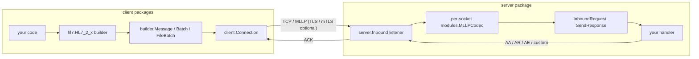

# 🩺 go-hl7

> A complete, dependency‑light HL7 v2.x toolchain for Go — **build**, **send**, **receive**, **acknowledge**, and **parse** HL7 messages over the traditional TCP / MLLP transport, with first‑class TLS and mTLS support.

[](https://pkg.go.dev/github.com/Bugs5382/go-hl7)
[](https://goreportcard.com/report/github.com/Bugs5382/go-hl7)
[](https://github.com/Bugs5382/go-hl7/actions/workflows/job-go-lang-ci.yaml)
[](./LICENSE)

`go-hl7` is everything you need to produce well‑formed HL7 messages and exchange them with a remote HL7 broker — a typed, spec‑driven builder for every HL7 v2.1 → v2.8 segment, a strict parser, an MLLP codec, an auto‑reconnecting outbound client, and an inbound listener with auto + custom acknowledgements.

It is a single Go module (`github.com/Bugs5382/go-hl7`) organized as two package trees:

- **`client`** — the core. The message model (the `builder` package), the spec‑driven typed builders (the `hl7` package), the `MLLPCodec` (the `modules` package), and the outbound TCP/MLLP `Client` + `Connection`.
- **`server`** — a TCP/TLS listener layer built on top of `client`. It accepts incoming HL7, parses it with the same `builder.Message`, hands each message to your handler, and replies with an ACK.

## 📦 Modules

| Module | Reference | What it does |
|---|---|---|
| [`client`](./client) | [](https://pkg.go.dev/github.com/Bugs5382/go-hl7/client) | 🩺 Builder, parser, MLLP codec, and outbound TCP/MLLP client. |
| [`server`](./server) | [](https://pkg.go.dev/github.com/Bugs5382/go-hl7/server) | 🏥 Inbound listener with auto + custom ACKs, MSH overrides, TLS/mTLS. |

## 🧭 Architecture at a glance



Every inbound TCP connection gets its **own** `MLLPCodec` instance so concurrent senders never interleave their byte streams.

## 🚀 60‑second example

Install:

```sh
go get github.com/Bugs5382/go-hl7
```

**Build a message** — chained, validated, version‑aware:

```go
package main

import (
	"fmt"

	"github.com/Bugs5382/go-hl7/client/hl7"
)

func main() {
	// Every Build* returns the builder, so you can compose top-to-bottom.
	b := hl7.NewHL7_2_5().
		BuildMSH(hl7.Props{
			"msh_3":  "MY_APP",
			"msh_4":  "MY_FAC",
			"msh_5":  "EPIC",
			"msh_6":  "HOSP",
			"msh_9":  "ADT^A01",
			"msh_10": "MSG00001",
			"msh_11": "P",
		}).
		BuildEVN(hl7.Props{"evn_1": "A01"}).
		BuildPID(hl7.Props{
			"pid_3": "MRN12345",
			"pid_5": "DOE^JANE^A",
			"pid_8": "F",
		})

	fmt.Println(b.String())
	msg := b.ToMessage() // a *builder.Message you can keep mutating or send
	_ = msg
}
```

**Send it** over MLLP and read the ACK:

```go
package main

import (
	"fmt"

	"github.com/Bugs5382/go-hl7/client/client"
	"github.com/Bugs5382/go-hl7/client/hl7"
)

func ptr[T any](v T) *T { return &v }

func main() {
	msg := hl7.NewHL7_2_5().
		BuildMSH(hl7.Props{"msh_9": "ADT^A01", "msh_10": "MSG00001", "msh_11": "P"}).
		ToMessage()

	c, _ := client.NewClient(client.ClientOptions{Version: "2.7", Host: "127.0.0.1"})
	conn, _ := c.CreateConnection(
		client.ClientListenerOptions{Port: ptr(3000)},
		func(res *client.InboundResponse) error {
			fmt.Println("✅ ACK:", res.GetMessage().Get("MSA.1").String()) // AA
			return nil
		},
	)
	defer conn.Close()

	_ = conn.SendMessage(msg)
}
```

**Receive and acknowledge** on the other side:

```go
package main

import (
	"fmt"

	"github.com/Bugs5382/go-hl7/server"
)

func ptr[T any](v T) *T { return &v }

func main() {
	srv, _ := server.NewServer(nil) // IPv4-only on 0.0.0.0 by default

	in, _ := srv.CreateInbound(
		server.ListenerOptions{Version: "2.7", Port: ptr(3000)},
		func(req *server.InboundRequest, res server.ResponseSender) error {
			fmt.Println("⬅️", req.GetMessage().Get("MSH.10").String())
			return res.SendResponse("AA") // Application Accept
		},
	)
	defer in.Close()

	in.On("listen", func(_ ...any) { fmt.Println("🎧 listening on :3000") })

	select {} // keep the process alive
}
```

## ✨ What's covered

- 🧱 **Typed builders** for HL7 2.1 → 2.8 (`hl7.NewHL7_2_5`, `hl7.NewHL7_2_7`, `hl7.NewHL7_2_8`, …) with field validation against HL7 tables.
- 🧮 **Per-version field availability** — every segment is backed by a `SegmentSpec` carrying R/O/B/W/D/X usage codes per HL7 version. The builder rejects withdrawn fields, warns on backward‑compatibility ones, and refuses segments that didn't exist in the chosen version (e.g. `ECD` before v2.4).
- 🔗 **Chainable build methods** — every `Build*` returns the builder, so `hl7.NewHL7_2_8().BuildMSH(...).BuildPID(...).String()` Just Works™.
- 🧰 **`BuildSegment(name, props)`** — universal spec‑driven builder for the long tail of segments when a hand‑tuned typed method isn't available.
- 🧬 **Typed composite inputs** — composite fields like `PID.11` accept either a `^`‑delimited string *or* a typed component object (a `map[string]any`). The runtime composer joins components with `^`, trims trailing empties, and validates each piece (R/W/X/length) per the spec.
- 📦 **Batches & file batches** with BHS/FHS framing.
- 🔁 **Auto reconnect & retry** with exponential backoff.
- 🤝 **Auto ACKs** (`AA` / `AR` / `AE` / `CA` / `CR` / `CE`) and **custom ACKs** for vendor‑shaped acknowledgements.
- 🧩 **MSH overrides** — drop in literal values or callback‑computed values per field.
- 🔌 **`req.GetSocket()`** — read peer / local connection details from inside your handler.
- 🛡️ **TLS** (server‑auth) and **mTLS** (mutual auth) with `RequestCert`, `RejectUnauthorized`, and CA bundles.
- 🧠 **Pluggable outbound queue** (in‑memory by default; Redis / RabbitMQ / SQL recommended for multi‑pod deployments).
- ⚡ **Per‑socket MLLP framing** that handles TCP fragmentation and concurrent connections safely.

## 📋 Requirements

- Go **`>= 1.26`**

## 🛠️ Working in the repo

The repo uses a [`Taskfile`](https://taskfile.dev):

```sh
task build        # go build ./...
task test         # go test ./...
task test-cover   # go test ./... -cover
task fmt          # gofmt + goimports
task lint         # gofmt check, golangci-lint, yamllint, gitleaks, license
task gen          # regenerate committed spec metadata (cmd/genspec)
```

Plain `go` works too:

```sh
go build ./...
go test ./...
```

## 📚 Per-package documentation

- 🩺 **Client** — builder API, batches, queues, parsing, the connection: [`client/README.md`](./client/README.md)
- 🏥 **Server** — quick start, TLS, mTLS, custom ACKs, events, performance: [`server/README.md`](./server/README.md)
- 📖 **Deep‑dive walkthroughs** — [`pages/`](./pages)
- 🌐 **API reference** — [pkg.go.dev/github.com/Bugs5382/go-hl7](https://pkg.go.dev/github.com/Bugs5382/go-hl7)

## 🧬 A note on the Go API

`go-hl7` is a standalone, idiomatic Go library. Two patterns recur throughout the API:

- **No method overloading.** Node‑style `get(string | number)` splits into `Get(path string)` for dotted HL7 paths (`"PID.5.1"`) and `Index(i int)` for a 0‑based child position. The same split applies to `Set` / `SetIndex`.
- **No exceptions.** Constructors return `(T, error)`; value coercions return `(T, ok)` (`Int()`, `Float()`, `Bool()`, `Date()`); a missing read returns a shared **empty node**, so chained `Get(...).String()` is always safe. The spec‑driven builders surface validation failures through a typed `HL7Error` hierarchy (matchable with `errors.Is`), and the event‑emitting builders/connections expose `On(event, handler)` over the same event‑name set.

## 📚 Keyword Definitions

This library supports medical applications with potential impact on patient care and diagnoses. The terms **MUST**, **MUST NOT**, **REQUIRED**, **SHALL**, **SHALL NOT**, **SHOULD**, **SHOULD NOT**, **RECOMMENDED**, **MAY**, and **OPTIONAL** in the documentation follow [RFC 2119](https://www.rfc-editor.org/rfc/rfc2119) semantics.

> ⚠️ **Capitalization matters.** These keywords carry their RFC 2119 meaning **only when written in ALL CAPS**. The lowercase forms (`must`, `should`, `may`, …) are normal English and are not normative.

## 🤝 Contributing

Contributions are welcome — bug reports, fixes, new HL7 segment coverage, docs improvements, and feature ideas.

1. 🍴 **Fork** the repo and create a topic branch.
2. ✅ **Add tests** for any behavior change. Run the whole suite with `go test ./...` (or `task test`).
3. 🧹 **Lint and format** with `task lint` from the repo root (commits follow [Conventional Commits](https://www.conventionalcommits.org)).
4. 🚀 **Open a PR.** CI runs build + tests + linters on every push.

For HL7 specification questions, the [Caristix HL7 reference](https://hl7-definition.caristix.com/v2/) is an excellent starting point.

## 🙏 Acknowledgements

- [`artifacthealth/hl7parser`](https://github.com/artifacthealth/hl7parser) — parser/builder design reference.
- [`node-rabbitmq-client`](https://github.com/cody-greene/node-rabbitmq-client) — connection logic inspiration.

## 📄 License

[MIT](./LICENSE)
