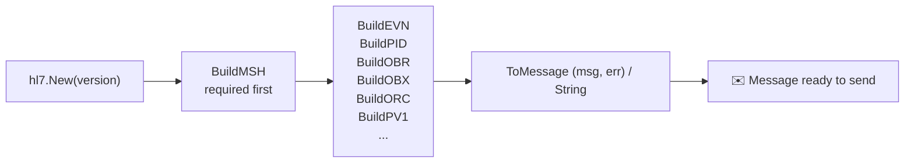
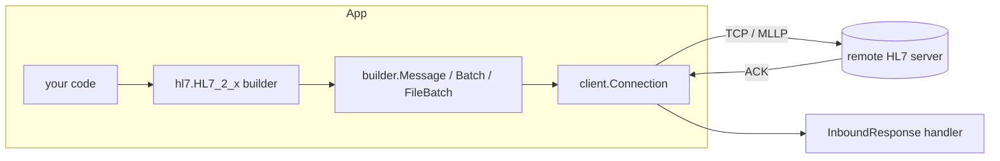

# 🩺 go-hl7 :: client

> The HL7 client/builder/parser for Go — build, send, parse, and reply to HL7 v2.x messages over MLLP. For the receiving side, see the companion [`server`](../server) package.

The `client` packages are a lightweight, dependency‑free toolkit for healthcare integrations. They speak the traditional TCP/MLLP transport, ship typed builders for every HL7 v2.1 → 2.8 segment, parse inbound responses, and include the `MLLPCodec` re‑used by the [`server`](../server) package.

```go
import (
	"github.com/Bugs5382/go-hl7/client/hl7"     // typed spec-driven builders (HL7_2_x)
	"github.com/Bugs5382/go-hl7/client/builder"  // the wire message model (Message/Batch/FileBatch)
	"github.com/Bugs5382/go-hl7/client/client"   // the outbound TCP/MLLP Client + Connection
	"github.com/Bugs5382/go-hl7/client/modules"  // the MLLPCodec
)
```

## ✨ Features

- ⚡ **Zero runtime dependencies** — fast, small, easy to audit (standard library only).
- 🧱 **Typed segment builders** — `New(V2_1)` through `New(V2_8)`, with `BuildMSH`, `BuildPID`, `BuildEVN`, `BuildOBX`, `BuildORC`, … all the segments you actually use.
- 🧮 **Per-version field availability** — every segment carries an HL7 v2 usage code per version (R/O/B/W/D/X). Withdrawn fields error, deprecated (B) fields warn, segments that didn't exist in your version are rejected. The full catalogue is exported as `metadata.SegmentSpecs`.
- 📑 **Version-aware HL7 value tables** — the **complete** set of HL7-defined value tables ships with the library (generated from Caristix, no runtime network), keyed by version. Every table-bound field and composite component is validated against the value set for your version, so an out-of-table code is a hard `HL7ValidationError` — and a code valid in one version can be rejected in another. Tables with no fixed value set for a version are not enforced. Exported as `tables.Tables`.
- 🔗 **Chainable builders** — every `Build*` returns the builder, so you can compose `hl7.New(hl7.V2_8).BuildMSH(...).BuildPID(...).String()` top‑to‑bottom.
- 🧰 **`BuildSegment(name, props)`** — universal spec‑driven builder for the long tail of segments when a hand‑tuned method isn't available.
- 🧬 **Typed composite inputs** — composite fields accept either a `^`‑delimited string or a typed component object (a `map[string]any`). Per‑component length, required, withdrawn, and not‑supported rules are enforced.
- 🔁 **Auto reconnect & retry** — exponential backoff, configurable attempt cap.
- 🧠 **Pluggable queue** — default in‑memory, or wire it up to Redis / RabbitMQ / SQL.
- 📦 **Builder + Parser + Client** — covers send, receive, and round‑trip.
- 💻 **Cross‑platform** — Windows, macOS, Linux.

## 📦 Install

```sh
go get github.com/Bugs5382/go-hl7
```

> 🟢 **Requires Go ≥ 1.26.**

## 🧾 Table of Contents

1. [Quick Start](#-quick-start)
2. [Building a Message (the class‑based builder)](#-building-a-message-the-class-based-builder)
3. [Building Batches & Files](#-building-batches--files)
4. [Sending a Message](#-sending-a-message)
5. [TLS](#-tls)
6. [Mutual TLS (mTLS)](#-mutual-tls-mtls)
7. [Parsing Replies](#-parsing-replies)
8. [Events](#-events)
9. [Custom Queues (Redis, etc.)](#-custom-queues-redis-etc)
10. [Errors](#-errors)
11. [Architecture](#-architecture)
12. [Detailed Docs](#-detailed-docs)
13. [Keyword Definitions](#-keyword-definitions)
14. [License](#-license)

---

## 🚀 Quick Start

```go
package main

import (
	"fmt"

	"github.com/Bugs5382/go-hl7/client/client"
	"github.com/Bugs5382/go-hl7/client/hl7"
)

func ptr[T any](v T) *T { return &v }

func main() {
	// 1) Build an ADT^A01. Every Build* returns the builder, so you can chain.
	msg, err := hl7.New(hl7.V2_5).
		BuildMSH(hl7.Props{
			"msh_3":  "MY_APP",
			"msh_4":  "MY_FAC",
			"msh_5":  "EPIC",
			"msh_6":  "HOSP",
			"msh_9":  "ADT^A01",
			"msh_10": "MSG00001",
			"msh_11": "P",
		}).
		BuildEVN(hl7.Props{"evn_1": "A01"}).
		BuildPID(hl7.Props{
			"pid_3": "MRN12345",
			"pid_5": "DOE^JANE^A",
			"pid_8": "F",
		}).
		ToMessage()
	if err != nil {
		panic(err) // the first validation failure in the chain
	}

	// 2) Open a persistent connection and send it.
	c, _ := client.NewClient(client.ClientOptions{Version: "2.7", Host: "127.0.0.1"})
	conn, _ := c.CreateConnection(
		client.ClientListenerOptions{Port: ptr(3000)},
		func(res *client.InboundResponse) error {
			fmt.Println("✅ ACK:", res.GetMessage().Get("MSA.1").String()) // AA
			return nil
		},
	)
	defer conn.Close()

	_ = conn.SendMessage(msg)
}
```

The class‑based builder validates segment fields against the complete, version‑aware set of HL7 value tables (e.g. `MSA.1` against table `0008`, `PID.8` against `0001`, `OBX.2` against `0125`) **and** against per‑version usage codes from the published HL7 spec — it rejects withdrawn fields (`W`/`X`), warns on backward‑compatibility ones (`B`), and refuses segments that didn't exist in the active version. The result is a real `builder.Message` you can keep mutating with `msg.Set("PID.13", ...)`, `msg.AddSegment("OBX")`, and so on.

> 💡 The `ptr` helper above turns a literal into a pointer. The option structs use pointer fields (e.g. `Port *int`) so the library can tell "not provided" from an explicit zero. Define a small generic helper once and reuse it.

---

## 🧱 Building a Message (the class‑based builder)



### Step 1 — Pick a version

```go
import "github.com/Bugs5382/go-hl7/client/hl7"

b := hl7.New(hl7.V2_5, hl7.Options{
	// Optional: override the default date format.
	// "8" = YYYYMMDD, "12" = YYYYMMDDHHMM, "14" = YYYYMMDDHHMMSS (default).
	Date: "14",
	// Optional: HardError promotes soft validation issues to a recorded
	// error immediately, instead of collecting them as "error" events.
	HardError: true,
})
```

`New` takes a `Version` constant: `V2_1`, `V2_2`, `V2_3`, `V2_3_1`, `V2_4`, `V2_5`, `V2_5_1`, `V2_6`, `V2_7`, `V2_7_1`, or `V2_8`. There is **no implicit default** — you select the spec version by the constant you pass, and that version drives every field‑usage check. `Options` is optional (`hl7.New(hl7.V2_5)` is valid).

### Step 2 — Build MSH (always first)

```go
b.BuildMSH(hl7.Props{
	"msh_3":  "SENDING_APP",
	"msh_4":  "SENDING_FAC",
	"msh_5":  "RECEIVING_APP",
	"msh_6":  "RECEIVING_FAC",
	"msh_9":  "ADT^A01",     // 2.4+ accepts the composite directly; or pass msh_9_1 / msh_9_2
	"msh_10": "MSG00001",    // control id; auto-randomized if omitted
	"msh_11": "P",           // P = production, T = test
})
```

> ⚠️ Calling any other `Build*` method before `BuildMSH` records `HL7FatalError("MSH Header must be built first.")` and short-circuits the rest of the chain. Calling `BuildMSH` twice records `HL7FatalError("You can only have one MSH Header per HL7 Message.")`. Either way, the error comes back from `ToMessage()`/`Err()`.

`Props` is `map[string]any`. It accepts the spec property keys (`msh_3`, `pid_5`, `obx_5`, …), bare field numbers as strings (`"3"`), human‑friendly aliases on MSH (`sendingApplication`, `receivingFacility`, …), and — for composite fields — a typed component object (see below). Values may be `string`, `int`, `time.Time`, or a `map[string]any` composite.

### Step 3 — Build segments

Each version exposes the segments valid for that version through typed `Build<XXX>` methods (e.g. `BuildEVN`, `BuildPID`, `BuildPV1`, `BuildOBR`, `BuildOBX`, `BuildORC`, `BuildNTE`, `BuildMSA`, `BuildERR`, and dozens more). Every one takes `hl7.Props` and returns the builder for chaining.

```go
b.BuildEVN(hl7.Props{"evn_1": "A01", "evn_2": time.Now()})

b.BuildPID(hl7.Props{
	"pid_3": "MRN12345",                          // patient id
	"pid_5": "DOE^JANE^A",                         // last^first^middle
	"pid_7": time.Date(1980, 1, 1, 0, 0, 0, 0, time.UTC), // DOB (time.Time or string)
	"pid_8": "F",                                  // sex (validated)
	"pid_11": "123 ELM ST^^SPRINGFIELD^IL^62701",  // address
})

b.BuildOBX(hl7.Props{
	"obx_1":  "1",
	"obx_2":  "TX",
	"obx_3":  "NOTE^Discharge Note^L",
	"obx_5":  "Patient stable, discharged home.",
	"obx_11": "F",                                  // status (validated)
})
```

| Builder | Segment | Notes |
|---|---|---|
| `BuildEVN(props)` | EVN | Event type/timestamps for ADT messages. |
| `BuildPID(props)` | PID | Patient identification. |
| `BuildPV1(props)` | PV1 | Patient visit. |
| `BuildOBR(props)` | OBR | Observation request. |
| `BuildOBX(props)` | OBX | Observation result. |
| `BuildORC(props)` | ORC | Common order. |
| `BuildNTE(props)` | NTE | Notes & comments. |
| `BuildMSA(props)` | MSA | Used when **building** ACKs by hand. |
| `BuildERR(props)` | ERR | Error segment. |

### 🧰 The universal builder: `BuildSegment`

For any segment that doesn't have a hand‑tuned typed method, use the generic spec‑driven builder. It reads the generated `SegmentSpec`, validates the version, and applies each field's usage code:

```go
b.BuildSegment("DG1", hl7.Props{
	"dg1_1": "1",
	"dg1_3": "I10^Diagnosis^I10",
})
```

`BuildSegment` rejects an unknown segment name, refuses a segment that isn't part of the active version, and (like the typed methods) requires `BuildMSH` to have run first. MSH itself must go through `BuildMSH`.

### 🎨 Composite values: pass the whole HL7 string

The builder treats a string prop as a literal field value, so you can embed HL7 delimiters directly instead of building components piece‑by‑piece:

```go
b.BuildMSH(hl7.Props{"msh_9": "ADT^A01"})                       // composite trigger
b.BuildPID(hl7.Props{
	"pid_5":  "DOE^JANE^A",                                       // last^first^middle
	"pid_11": "123 ELM ST^^SPRINGFIELD^IL^62701",                 // ^^ skips a component
	"pid_13": "555-0100~555-0200",                                // ~ separates repetitions
})
```

| Delimiter | Means | Example |
|:---:|---|---|
| `^` | next component | `"DOE^JANE^A"` |
| `&` | next sub‑component | `"123 ELM ST&APT 4^^CITY"` |
| `~` | next repetition | `"555-0100~555-0200"` |
| `^^` | leave a component empty | `"ST^^CITY^STATE^ZIP"` |

### 🧬 Composite values: pass a typed object

A composite field may also be given as a `map[string]any` of its components. The composer joins them with `^`, trims trailing empties, and validates each component against its spec (required / withdrawn / not‑supported / length):

```go
b.BuildPID(hl7.Props{
	"pid_11": map[string]any{
		"streetAddress":   "123 ELM ST",
		"city":            "SPRINGFIELD",
		"stateOrProvince": "IL",
		"zipOrPostalCode": "62701",
	},
})
```

Component keys are resolved by numeric position (`"1"`), by a trailing `_<num>` key, or by the camelCased component label from the spec. A withdrawn or not‑supported component with a value raises `HL7ValidationError`.

### Step 4 — Convert

```go
msg, err := b.ToMessage()  // (*builder.Message, error) — err is the first validation failure
if err != nil {
	// handle the bad input; msg is the partial tree built so far
}
text := b.String()         // the HL7 text built so far
```

The resulting MSH for the example above:

```text
MSH|^~\&|SENDING_APP|SENDING_FAC|RECEIVING_APP|RECEIVING_FAC|20240101000000||ADT^A01|MSG00001|P|2.5
EVN|A01|20240101000000
PID|||MRN12345||DOE^JANE^A||19800101|F|||123 ELM ST^^SPRINGFIELD^IL^62701
OBX|1|TX|NOTE^Discharge Note^L||Patient stable, discharged home.||||||F
```

### 🛠️ Direct edits with `msg.Set(...)`

`ToMessage()` returns a real `builder.Message` (alongside the first build error) you can keep mutating after the builder is done — useful for fields the builder doesn't surface:

```go
msg, err := b.ToMessage()
if err != nil {
	return err
}
msg.Set("PID.13", "555-0100")          // home phone, dotted path
msg.Get("PV1.7").SetIndex(0, "Jones")  // 0-based child position (the Index/SetIndex split)
```

`Set(path, value)` uses 1‑based dotted HL7 paths; `SetIndex(i, value)` writes at a 0‑based child position. The same split applies to reads — `Get(path)` vs `Index(i)`.

### Encoding characters

Defaults are the HL7 standard: `|` field, `^` component, `&` sub‑component, `~` repetition, `\` escape. To send through a system that uses non‑standard delimiters, set them once on the builder options:

```go
b := hl7.New(hl7.V2_5, hl7.Options{
	SeparatorField:        "!",
	SeparatorComponent:    "+",
	SeparatorSubComponent: "]",
	SeparatorRepetition:   "?",
	SeparatorEscape:       "#",
})
```

These can't be changed after construction — they're embedded in `MSH.1` and `MSH.2`.

---

## 📚 Building Batches & Files

A **batch** is multiple messages wrapped in BHS / BTS. A **file batch** is wrapped in FHS / FTS — useful for flat files for legacy systems and audit trails. Both live in the `builder` package and both satisfy the `MessageItem` interface, so either can be passed straight to `conn.SendMessage`.

```go
import "github.com/Bugs5382/go-hl7/client/builder"

// A batch: BHS + N messages + BTS.
batch, _ := builder.NewBatch(builder.BatchOptions{})
batch.Start("")              // (re)stamp BHS.7; "" = default 14-char date
batch.Add(makeMessage("MSG00001"), -1) // index -1 appends
batch.Add(makeMessage("MSG00002"), -1)
batch.End()                  // append BTS with the message count

_ = conn.SendMessage(batch)

// A file batch: FHS + content + FTS.
file, _ := builder.NewFileBatch(builder.FileOptions{})
file.Start()
file.AddMessage(makeMessage("MSG00001"))
file.AddMessage(makeMessage("MSG00002"))
file.End()

// Serialize straight to disk (set Location on FileOptions to enable):
file, _ = builder.NewFileBatch(builder.FileOptions{Location: "./out", Extension: "hl7"})
file.Start()
file.AddMessage(makeMessage("MSG00001"))
file.End()
_ = file.CreateFile("ADT")   // writes hl7.ADT.<date>.hl7 under ./out
name := file.FileName()
_ = name
```

`Message.ToFile(name, newLine, location, extension)` and `Batch.ToFile(...)` are convenience wrappers that build a one‑shot `FileBatch` and write it.

Receivers process each inner message individually — the [`server`](../server) package invokes your handler once per message inside a batch or file.

---

## 📤 Sending a Message

```go
import "github.com/Bugs5382/go-hl7/client/client"

c, _ := client.NewClient(client.ClientOptions{Version: "2.7", Host: "127.0.0.1"})

conn, _ := c.CreateConnection(
	client.ClientListenerOptions{
		Port:                  ptr(3000),
		WaitAck:               ptr(true), // default: wait for ACK before next send
		MaxConnectionAttempts: ptr(10),   // reconnect attempts before giving up
	},
	func(res *client.InboundResponse) error {
		status := res.GetMessage().Get("MSA.1").String()
		if status != "AA" {
			fmt.Println("⚠️ rejected:", status)
		}
		return nil
	},
)
defer conn.Close()

_ = conn.SendMessage(msg)
```

The connection is persistent; you can send many messages over a single TCP/MLLP socket. `SendMessage` accepts any `MessageItem` (`*builder.Message`, `*builder.Batch`, or `*builder.FileBatch`).

### 🔖 Required HL7 version (single‑set per client)

`ClientOptions.Version` is **required** and pins the client to a single HL7 version. It must be one of the known versions — `2.1`, `2.2`, `2.3`, `2.3.1`, `2.4`, `2.5`, `2.5.1`, `2.6`, `2.7`, `2.7.1`, `2.8` — or `NewClient` returns an error (`version is not defined.` / `version is not a valid HL7 version.`).

Every connection opened from a client inherits that one version, and `SendMessage` enforces it: before a message is queued or transmitted, its `MSH.12` must equal the configured version. If it differs, `SendMessage` returns an error and **does not send** (for a batch or file, *every* contained message's `MSH.12` must match).

```go
c, _ := client.NewClient(client.ClientOptions{Version: "2.7", Host: "127.0.0.1"})
// ...
// msg built at MSH.12 = 2.5 → rejected, never transmitted:
if err := conn.SendMessage(msg); err != nil {
	fmt.Println("⛔", err) // message version "2.5" does not match the connection version "2.7".
}
```

Useful methods on `*Connection`: `Connect()` (when `AutoConnect` is false), `Close()`, `IsConnected()`, and `GetPort()`. On `*Client`: `CreateConnection`, `CloseAll()`, `TotalSent()`, `TotalAck()`, `TotalPending()`, and `GetHost()`.

### 🌐 IPv4 + IPv6 (Dual-Stack)

The client supports IPv4, IPv6, and FQDN hosts. **It runs IPv4‑only by default.** Opt into dual‑stack by setting both `IPv4` and `IPv6` to `true`; passing only one is treated as exclusive (that family only), and IP literals are validated against the chosen family.

```go
// IPv4 only (default)
c, _ := client.NewClient(client.ClientOptions{Version: "2.7", Host: "hl7.example.com"})

// Dual-stack with auto-fallback (opt-in)
dual, _ := client.NewClient(client.ClientOptions{
	Version: "2.7", Host: "hl7.example.com", IPv4: ptr(true), IPv6: ptr(true),
})

// Force IPv6 only
v6, _ := client.NewClient(client.ClientOptions{Version: "2.7", Host: "fd00::42", IPv6: ptr(true)})
```

| Option | Meaning |
|---|---|
| (defaults) | IPv4 only — host literal must be IPv4 |
| `IPv4: true, IPv6: true` | dual‑stack |
| `IPv6: true` only | force IPv6 — host literal must be IPv6 |

> 💡 Setting both `IPv4` and `IPv6` to `false` returns an error from `NewClient`.

### Reconnect, retry, and queue tuning

When the socket drops, the connection schedules an exponential‑backoff reconnect (`RetryLow` → `RetryHigh`, capped by `MaxConnectionAttempts`). While disconnected — or while `WaitAck` is set and a previous ACK is still outstanding — outbound messages are queued (default in‑memory, capped at `MaxLimit`, default 10000) and flushed on reconnect.

| `ClientOptions` | Default | Purpose |
|---|---|---|
| `Version` | — | **required** HL7 version (`2.1`..`2.8`); every sent message's `MSH.12` must match or `SendMessage` rejects it. |
| `Host` | — | FQDN or IPv4/IPv6 address. |
| `ConnectionTimeout` | `0` | ms before a stalled connection is ended and retried; `0` stays connected. |
| `MaxAttempts` | `10` | message‑send retries while reconnecting (1..50). |
| `MaxConnectionAttempts` | `10` | initial/reconnect attempts (1..50). |
| `MaxTimeout` | `10` | connection‑timeout occurrences before giving up. |
| `RetryLow` / `RetryHigh` | `1000` / `30000` | backoff step / ceiling, ms. |
| `TLS` | `nil` | non‑nil enables TLS (see below). |

| `ClientListenerOptions` | Default | Purpose |
|---|---|---|
| `Port` | — | remote port (required). |
| `AutoConnect` | `true` | connect on creation; otherwise call `Connect()`. |
| `WaitAck` | `true` | serialize sends on the previous ACK. |
| `MaxLimit` | `10000` | in‑memory pending‑queue cap. |
| `ExtendMaxLimit` | `false` | let the queue grow past `MaxLimit` instead of dropping the oldest. |
| `NotifyOnLimitExceeded` | `false` | emit `limitExceeded` when the queue overflows. |
| `EnqueueMessage` / `FlushQueue` | `nil` | custom queue hooks (see [Custom Queues](#-custom-queues-redis-etc)). |

---

## 🔒 TLS

A non‑nil `*client.TLSConfig` enables TLS. Pass the empty `&client.TLSConfig{}` to use the system trust store, or fill it in for full control:

```go
import (
	"os"

	"github.com/Bugs5382/go-hl7/client/client"
)

ca, _ := os.ReadFile("certs/server-ca-crt.pem")

c, _ := client.NewClient(client.ClientOptions{
	Version: "2.7",
	Host: "hl7.example.local",
	TLS: &client.TLSConfig{
		// 🪪 Self-signed / in-house CA? Provide it explicitly.
		CA: ca,
		// RejectUnauthorized: leave nil to keep Go's default verification on.
		// Set to ptr(false) to skip verification (local dev only).
	},
})

conn, _ := c.CreateConnection(client.ClientListenerOptions{Port: ptr(6661)},
	func(res *client.InboundResponse) error {
		fmt.Println("✅", res.GetMessage().Get("MSA.1").String())
		return nil
	})
_ = conn.SendMessage(msg)
```

> 🚨 Leave `RejectUnauthorized` `nil` (the secure default) in production. Setting it to `ptr(false)` skips cert validation entirely — fine for local dev, dangerous on the open network.

The shorthand for "trust the system roots" is simply `TLS: &client.TLSConfig{}`.

---

## 🛡️ Mutual TLS (mTLS)

Many hospital networks require **client‑certificate authentication**. Provide your own `Cert` + `Key` so the server can validate *you* in addition to validating the server cert:

```go
key, _ := os.ReadFile("certs/client-key.pem")
crt, _ := os.ReadFile("certs/client-crt.pem")
ca, _  := os.ReadFile("certs/server-ca-crt.pem")

c, _ := client.NewClient(client.ClientOptions{
	Version: "2.7",
	Host: "hl7.example.local",
	TLS: &client.TLSConfig{
		Cert:       crt, // 🔑 the client's identity
		Key:        key,
		CA:         ca,  // 🪪 the CA(s) you trust to issue the server's cert
		ServerName: "hl7.example.local", // optional SNI / expected hostname override
	},
})
```

| Field | What it does |
|---|---|
| `Cert` + `Key` | Your client identity. The server validates these against its trusted CAs. |
| `CA` | The trusted issuer(s) for the **server**'s certificate. |
| `RejectUnauthorized` | `*bool`; `nil`/`true` keeps verification on, `ptr(false)` skips it. Keep it on in production. |
| `ServerName` | SNI / expected server hostname. Defaults to `Host`; override only if the cert CN differs. |

> 💡 The matching server‑side configuration lives in the [`server`](../server) package — see its [TLS / mTLS docs](../server/README.md#-mutual-tls-mtls).

---

## 🔍 Parsing Replies

The same `builder.Message` class powers parsing. Construct one from raw text:

```go
import "github.com/Bugs5382/go-hl7/client/builder"

msg, err := builder.NewMessage(builder.MessageOptions{Text: hl7String})
if err != nil { /* malformed HL7 */ }

msg.Get("MSH.9.1").String()  // ADT
msg.Get("PID.5.1").String()  // DOE
msg.Get("PID.3").Index(0).Index(3).String() // repetition 0, component 3
msg.Exists("PV1.44")          // false when the path resolves to the empty node
```

Reads of a missing path return a shared **empty node**, so chained `Get(...).String()` is always safe (it yields `""`). Value coercions return `(T, ok)`:

```go
n, ok := msg.Get("OBX.5").Int()     // (int, bool)
f, ok := msg.Get("OBX.5").Float()   // (float64, bool)
b, ok := msg.Get("PID.30").Bool()   // "Y"/"N" -> (bool, bool)
t, ok := msg.Get("PID.7").Date()    // HL7 date -> (time.Time, bool)
```

Batches and files:

```go
batch, _ := builder.NewBatch(builder.BatchOptions{Text: hl7BatchString})
for _, m := range batch.Messages() {
	_ = m.Get("MSH.10").String()
}

file, _ := builder.NewFileBatch(builder.FileOptions{FullFilePath: "ADT.20240101.hl7"})
for _, m := range file.Messages() {
	_ = m
}
```

> ⚠️ The parser is strict — malformed HL7 yields an `error` from the constructor, and some structural read failures panic with an `HL7Error`. `NewMessage` rejects a body that doesn't begin with `MSH` or one carrying multiple MSH segments (use `Batch` for that). `NewBatch` rejects a single‑MSH body. `NewMessage`, `NewBatch`, and `NewFileBatch` all return `(T, error)`.

---

## 📡 Events

`*Client` and `*Connection` embed an event emitter. Register handlers with `On(name, handler)` or one‑shot with `Once(name, handler)`; handlers take a variadic `...any` payload.

```go
conn.On("connect", func(_ ...any) { fmt.Println("🔌 connected") })
conn.On("client.sent", func(args ...any) { fmt.Println("📤 sent #", args[0]) })
conn.On("client.acknowledged", func(args ...any) { fmt.Println("✅ acked #", args[0]) })
conn.On("client.error", func(args ...any) { fmt.Println("💥", args[0]) })
conn.On("data.raw", func(args ...any) { fmt.Println("📥", args[0]) })
```

| Event | Payload | When |
|---|---|---|
| `connecting` | _none_ | A connection attempt is starting. |
| `connect` / `connection` | _none_ | The socket reached the connected/open state. |
| `close` | _none_ | The connection closed. |
| `client.sent` | `int` | A message was written (running count). |
| `client.acknowledged` | `int` | An ACK was received (running count). |
| `client.pending` | `int` | The pending‑queue depth changed. |
| `client.error` | `error` | A socket / dial error (e.g. `ECONNREFUSED`). |
| `client.timeout` | _none_ | The connection timeout fired. |
| `client.limitExceeded` / `limitExceeded` | `int` (port) | The pending queue overflowed (`Connection` / re‑emitted on `Client`). |
| `data.raw` | `string` | The full de‑framed payload, before parsing. |
| `data.error` | `error` | A frame couldn't be parsed. |

The typed builders (`*hl7.Builder`) expose their own `On("error", func(string))` and `On("warning", func(string))` for soft validation findings (collected unless `HardError` is set).

---

## 🧰 Custom Queues (Redis, etc.)

By default outbound messages are queued in memory, capped at `MaxLimit` (10000) per connection. For any multi‑pod deployment, **offload the queue** to Redis (preferred) or another durable store so messages survive restarts. Provide the `EnqueueMessage` and `FlushQueue` hooks on `ClientListenerOptions`:

```go
conn, _ := c.CreateConnection(
	client.ClientListenerOptions{
		Port:        ptr(3000),
		AutoConnect: ptr(false),
		EnqueueMessage: func(m client.MessageItem, notify client.NotifyPendingCount) error {
			// e.g. redis.LPush(ctx, "hl7queue", m.String())
			return notify(queueDepth())
		},
		FlushQueue: func(deliver client.FallBackHandler, notify client.NotifyPendingCount) error {
			for queueDepth() > 0 {
				raw := pop() // pop one body off your store
				msg, err := builder.NewMessage(builder.MessageOptions{Text: raw})
				if err != nil {
					return err
				}
				deliver(msg)
				if err := notify(queueDepth()); err != nil {
					return err
				}
			}
			return nil
		},
	},
	func(res *client.InboundResponse) error { return nil },
)
```

`MessageItem` is anything with a `String() string` method, so a custom store can persist `m.String()` and rebuild a `Message` on flush. `FallBackHandler` delivers a queued message back into the connection; `NotifyPendingCount` reports the depth (and feeds the `client.pending` event).

> 🔐 **Tag messages per client instance** if you share a queue across services — otherwise one pod might dequeue messages destined for another.

> 🗄️ Need the queue to **survive a restart**? See the [durable database-backed queue walkthrough](../pages/client/durable-queue/index.md) — a PostgreSQL worked example (with MongoDB and MySQL on the same hooks) that persists `pending_messages` and flushes them on reconnect.

---

## 🧯 Errors

Constructors and senders return `error`; the spec‑driven builders accumulate the first failure and return it from `ToMessage()`/`Err()` (and `CheckMSH` returns its error directly). Only genuine programmer misuse — undefined `InboundRequest` accessors and abstract node stubs — still panics. The error hierarchy is in the `helpers` package and is matchable with `errors.Is`:

```go
import (
	"errors"

	"github.com/Bugs5382/go-hl7/client/helpers"
)

_, err := builder.NewMessage(builder.MessageOptions{Text: "not hl7"})
if errors.Is(err, helpers.ErrParser) {
	// HL7ParserError (code 404)
}
```

| Sentinel | Type | Meaning |
|---|---|---|
| `helpers.ErrFatal` | `HL7FatalError` (500) | A fatal connection/usage failure. |
| `helpers.ErrParser` | `HL7ParserError` (404) | A parser failure. |
| `helpers.ErrValidation` | `HL7ValidationError` (404) | A spec‑driven field‑validation failure. |

The typed builders record hard validation failures (the Go analog of the spec's `throw`) onto the builder. Check `b.ToMessage()`'s error — or `b.Err()` mid-chain — to handle them at a boundary; no `recover` needed.

---

## 🏗️ Architecture



The `MLLPCodec` (in the `modules` package) frames a body as `<VT>` (0x0B) + body + `<FS>` (0x1C) + `<CR>` (0x0D), and buffers incoming bytes until a complete `<FS><CR>` frame arrives — so a message split across many TCP packets reassembles correctly.

---

## 📖 Detailed Docs

- [Builder walkthrough](../pages/client/index.md)
- [API reference](https://pkg.go.dev/github.com/Bugs5382/go-hl7/client)

---

## 📚 Keyword Definitions

The terms **MUST**, **MUST NOT**, **REQUIRED**, **SHALL**, **SHALL NOT**, **SHOULD**, **SHOULD NOT**, **RECOMMENDED**, **MAY**, and **OPTIONAL** in this documentation follow [RFC 2119](https://www.rfc-editor.org/rfc/rfc2119) semantics.

> ⚠️ **Capitalization matters.** These keywords carry their RFC 2119 meaning **only when written in ALL CAPS**.

## 📄 License

[MIT](../LICENSE)
