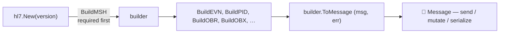

# 🧱 go-hl7 Client :: Builder

> Build valid HL7 v2.x messages with typed segment builders. The class‑based format validates fields against HL7 tables, raises clear errors, and lets you keep the parsed `builder.Message` for further edits.

## 🧾 Table of Contents

1. [The big picture](#-the-big-picture)
2. [Pick a version (`New`)](#-pick-a-version-new)
3. [Build the MSH (always first)](#-build-the-msh-always-first)
4. [Build the rest of your segments](#-build-the-rest-of-your-segments)
5. [Per-version field availability (usage codes)](#-per-version-field-availability-usage-codes)
6. [Chainable build methods](#-chainable-build-methods)
7. [`BuildSegment` — generic spec-driven builder](#-buildsegment--generic-spec-driven-builder)
8. [Composite values inline](#-composite-values-inline--pass-the-whole-string)
9. [Date formats](#-date-formats)
10. [Encoding characters](#-encoding-characters)
11. [Direct edits with `msg.Set(...)`](#-direct-edits-with-msgset)
12. [Building Batches](#-building-batches)
13. [Building File Batches](#-building-file-batches)
14. [Refactor pattern: factory functions](#-refactor-pattern-factory-functions)
15. [Validation & errors](#-validation--errors)

---

## 🌐 The big picture



- **`hl7.New(version)`** — the builder constructor; pass a `Version` constant (`hl7.V2_3`, `hl7.V2_5`, `hl7.V2_7`, `hl7.V2_8`, …). It returns a `*hl7.Builder` configured for that spec, exposing the segments that exist in that version.
- **`BuildMSH(props)`** — must be called first. Anything else records `HL7FatalError("MSH Header must be built first.")`, which surfaces from `ToMessage()`/`Err()`.
- **`Build<SEG>(props)`** — every other segment has a typed builder, and each returns the builder for chaining. The first hard validation failure is recorded and short-circuits the rest of the chain.
- **`ToMessage()`** — returns `(*builder.Message, error)`. The message is the tree built so far; the error is the first validation failure, if any. `Err()` exposes the same error mid-chain.
- **`String()`** — returns the framed HL7 text.

> 💡 The builder is **not** the parser. To turn a string back into a `Message`, use `builder.NewMessage(builder.MessageOptions{Text: ...})`. See the [parser docs](../parser/index.md).

> 💡 The option structs use pointer fields so the library can tell "not provided" from an explicit zero. Define a small generic helper once and reuse it: `func ptr[T any](v T) *T { return &v }`.

---

## 🎯 Pick a version (`New`)

```go
import "github.com/Bugs5382/go-hl7/client/hl7"

builder := hl7.New(hl7.V2_5, hl7.Options{
    // Date format used when a time.Time is passed to a Build* method.
    // "8" → YYYYMMDD, "12" → YYYYMMDDHHMM, "14" → YYYYMMDDHHMMSS (default).
    Date: "14",

    // When true, soft validation issues are recorded as an error immediately
    // instead of being collected and emitted on the "error" event.
    // Recommended in dev/CI.
    HardError: true,
})
```

`New` takes a `Version` constant: `V2_1`, `V2_2`, `V2_3`, `V2_3_1`, `V2_4`, `V2_5`, `V2_5_1`, `V2_6`, `V2_7`, `V2_7_1`, or `V2_8`. There is **no implicit default** — you select the spec version by the constant you pass, and that version drives every field‑usage check. `Options` is optional (`hl7.New(hl7.V2_5)` is valid).

| Version | Selector | Notable additions |
|---|---|---|
| 2.1 | `New(V2_1)` | The minimal baseline. Composite `MSH.9.3` is **not** allowed. |
| 2.2 | `New(V2_2)` | Adds AL1 (allergy) and other segments. |
| 2.3 | `New(V2_3)` | Adds DG1, IN2, GT1 enhancements, ROL, etc. |
| 2.3.1 / 2.4 | `New(V2_3_1)`, `New(V2_4)` | `MSH.9.3` becomes optional / composite‑allowed. |
| 2.5 → 2.7.1 | `New(V2_5)`, `New(V2_5_1)`, `New(V2_6)`, `New(V2_7)`, `New(V2_7_1)` | Adds SFT, SPM, and many other segments. |
| 2.8 | `New(V2_8)` | Latest supported. Inherits the full 2.7.1 surface. |

---

## 🏷️ Build the MSH (always first)

```go
builder.BuildMSH(hl7.Props{
    "msh_3":  "SENDING_APP",     // Sending application
    "msh_4":  "SENDING_FAC",     // Sending facility
    "msh_5":  "RECEIVING_APP",   // Receiving application
    "msh_6":  "RECEIVING_FAC",   // Receiving facility
    // msh_7 (date) is auto-set to "now" if you omit it
    "msh_9":  "ADT^A01",         // Composite (2.4+) or "ACK" / "ADT" (2.1)
    "msh_10": "MSG00001",        // Auto-randomized if omitted
    "msh_11": "P",               // P=production, T=test
})
```

Resulting MSH (HL7 2.5):

```text
MSH|^~\&|SENDING_APP|SENDING_FAC|RECEIVING_APP|RECEIVING_FAC|20240101000000||ADT^A01|MSG00001|P|2.5
```

> ⚠️ Calling any other `Build*` method before `BuildMSH` records `HL7FatalError("MSH Header must be built first.")` and short-circuits the chain. Calling `BuildMSH` twice records `HL7FatalError("You can only have one MSH Header per HL7 Message.")`. The error comes back from `ToMessage()`/`Err()`.

> 💡 **`Props` is `map[string]any`.** It accepts the spec property keys (`msh_3`, `pid_5`, `obx_5`, …), bare field numbers as strings (`"3"`), human‑friendly aliases on MSH (`sendingApplication`, `receivingFacility`, …), and — for composite fields — a typed component object. Values may be `string`, `int`, `time.Time`, or a `map[string]any` composite.

> ⚠️ **2.1 quirk.** `MSH.9.3` (composite event code) is forbidden in 2.1. The library rejects it.

---

## 🧬 Build the rest of your segments

Every version exposes typed builders for the segments it supports. Each takes `hl7.Props` and returns the builder for chaining. Common examples:

### EVN — event timestamp (ADT)

```go
builder.BuildEVN(hl7.Props{
    "evn_1": "A01",        // event type code
    "evn_2": time.Now(),   // recorded date (time.Time is auto-formatted)
})
```

### PID — patient identification

```go
builder.BuildPID(hl7.Props{
    "pid_3":  "MRN12345",                                  // patient id (often the MRN)
    "pid_5":  "DOE^JANE^A",                                 // last^first^middle
    "pid_7":  time.Date(1980, 1, 1, 0, 0, 0, 0, time.UTC),  // DOB
    "pid_8":  "F",                                          // sex (validated, TABLE_0001)
    "pid_11": "123 ELM ST^^SPRINGFIELD^IL^62701",           // address
    "pid_13": "555-0100",                                   // home phone
})
```

Resulting PID:

```text
PID|||MRN12345||DOE^JANE^A||19800101|F|||123 ELM ST^^SPRINGFIELD^IL^62701||555-0100
```

### OBX — observation

```go
builder.BuildOBX(hl7.Props{
    "obx_1":  "1",
    "obx_2":  "TX",                                  // value type, TABLE_0125
    "obx_3":  "NOTE^Discharge Note^L",               // observation identifier
    "obx_5":  "Patient stable, discharged home.",    // value
    "obx_11": "F",                                   // status, TABLE_0085 (F = Final)
})
```

### MSA — message acknowledgement (when **building** ACKs by hand)

```go
builder.BuildMSA(hl7.Props{
    "msa_1": "AA",          // TABLE_0008
    "msa_2": "MSG00001",    // echoed control id
    "msa_3": "All good",
})
```

### Other segments

`BuildACC`, `BuildBLG`, `BuildDG1`, `BuildDSC`, `BuildEVN`, `BuildFT1`, `BuildGT1`, `BuildIN1`, `BuildMRG`, `BuildNK1`, `BuildNPU`, `BuildNTE`, `BuildOBR`, `BuildORC`, `BuildPR1`, `BuildPV1`, `BuildQRD`, `BuildQRF`, `BuildRX1`, `BuildUB1`, `BuildURD`, `BuildURS`, `BuildSFT`, `BuildSPM`, … and more.

> 📚 **Full segment reference:** see [`pages/client/segments/index.md`](../segments/index.md) for a complete compatibility matrix of every supported segment across HL7 v2.1 → v2.8, plus links to the canonical [Caristix](https://hl7-definition.caristix.com/v2/) field reference.

---

## 🧮 Per-version field availability (usage codes)

Every segment is backed by a `SegmentSpec` derived directly from the [Caristix HL7 Definition API](https://hl7-definition.caristix.com/v2/), one per segment, covering every version from 2.1 → 2.8. Each field carries an HL7 **usage code** per version, and the builder enforces them at runtime — so you cannot, for example, accidentally set `ECD.4` on a v2.8 message (it was withdrawn).

| Code | Constant | Meaning | What the builder does when a value is provided |
|:---:|---|---|---|
| **R** | `metadata.UsageRequired` | Required | Field MUST be populated. Missing => `HL7ValidationError`. |
| **O** | `metadata.UsageOptional` | Optional | No constraint. |
| **B** | `metadata.UsageBackward` | Backward Compatibility | Emits a deprecation message on the `"warning"` event; value still serializes. |
| **W** | `metadata.UsageWithdrawn` | Withdrawn | `HL7ValidationError` — always, regardless of `HardError`. |
| **X** | `metadata.UsageNotSupport` | Not Supported | `HL7ValidationError` — always. |
| **D** | `metadata.UsageDependent` | Dependent / Conditional | Value is allowed; if the spec carries a machine-readable `DependsOn`, it is enforced. Most published `D` fields have prose-only conditions and are accepted as-is. |
| _(missing)_ | — | Field not in this version | `HL7ValidationError` — the field doesn't exist in the chosen HL7 version. |

The canonical example — `ECD.4 Requested Completion Time`:

| Version | Usage | Behavior |
|:---:|:---:|---|
| 2.4 | O | Settable. |
| 2.5 / 2.5.1 / 2.6 | B | Settable, emits `"warning"`. |
| 2.7 / 2.7.1 / 2.8 | W | `HL7ValidationError("Field ECD.4 is withdrawn in HL7 v2.7…")`. |

```go
b := hl7.New(hl7.V2_8)
b.On("warning", func(m string) { fmt.Println("⚠️", m) })

b.BuildMSH(hl7.Props{"msh_9": "ADT^A01", "msh_10": "X", "msh_11": "P"})

// ✅ ok — ECD.1, ECD.2 are R, ECD.3 is O.
b.BuildECD(hl7.Props{"ecd_1": "1", "ecd_2": "RC^Pause^HL70368", "ecd_3": "Y"})

// 🛑 records an error — ECD.4 is W in 2.8. Check it with b.Err()/ToMessage().
b.BuildECD(hl7.Props{"ecd_1": "2", "ecd_2": "RC^Resume^HL70368", "ecd_4": "20240101"})

// 🛑 records an error — ECD didn't exist before v2.4.
_, err := hl7.New(hl7.V2_3_1).
    BuildECD(hl7.Props{"ecd_1": "1"}).
    ToMessage() // err: "Segment ECD is not part of HL7 v2.3.1"
```

### Inspecting the spec at runtime

The full catalogue is exported as `metadata.SegmentSpecs` so you can introspect, pretty-print, or build your own UI/codegen on top of it:

```go
import "github.com/Bugs5382/go-hl7/client/hl7/metadata"

ecd := metadata.SegmentSpecs["ECD"]
fmt.Println(ecd.Versions)
// → [2.4 2.5 2.5.1 2.6 2.7 2.7.1 2.8]

fmt.Println(ecd.Fields[3]) // ECD.4
// → {Num: 4, Name: "Requested Completion Time", HL7Type: "ST",
//     Usage: map[2.4:O 2.5:B … 2.8:W]}
```

`SegmentSpec` carries `Name`, `Versions []metadata.HL7Version`, and `Fields []metadata.FieldSpec`. Each `FieldSpec` carries `Num`, `Name`, `HL7Type`, `Components`, `DependsOn`, and `Usage map[metadata.HL7Version]metadata.HL7UsageCode`.

### Sub-component metadata for composite fields

For composite HL7 data types (`XAD`, `XPN`, `CE`, `CWE`, `CX`, `EI`, `HD`, …), each `FieldSpec` carries a `Components` slice describing the `^`-delimited pieces of the field value — name, data type, length, table reference, and usage. This is sourced from the Caristix DataType endpoint per HL7 version.

```go
var pid11 metadata.FieldSpec
for _, f := range metadata.SegmentSpecs["PID"].Fields {
    if f.Num == 11 {
        pid11 = f
        break
    }
}
// pid11 → { Num: 11, Name: "Patient Address", HL7Type: "XAD",
//           Usage: map[2.1:O … 2.8:O],
//           Components: []metadata.ComponentSpec{
//             {Num: 1, Name: "Street Address",     HL7Type: "SAD", Usage: "O"},
//             {Num: 2, Name: "Other Designation",  HL7Type: "ST",  Usage: "O"},
//             {Num: 3, Name: "City",               HL7Type: "ST",  Usage: "O"},
//             {Num: 4, Name: "State Or Province",  HL7Type: "ST",  Usage: "O"},
//             {Num: 5, Name: "Zip Or Postal Code", HL7Type: "ST",  Usage: "O"},
//             {Num: 6, Name: "Country",            HL7Type: "ID",  Usage: "O"},
//             // …17 more (Address Type, County/Parish Code, Census Tract, …)
//           } }
```

Primitive types (`ST`, `NM`, `ID`, `DTM`, `SI`, …) have no `Components`.

### Typed composite inputs (objects → `^`-delimited strings)

A composite field may also be given as a `map[string]any` of its components. The composer joins them with `^`, trims trailing empties, and validates each component against its spec (R required, W/X rejected, max-length checked):

```go
b := hl7.New(hl7.V2_8)
b.BuildMSH(hl7.Props{"msh_9": "ADT^A01", "msh_10": "X", "msh_11": "P"})

// Style A — typed object (composer handles the `^` joining + validation)
b.BuildPID(hl7.Props{
    "pid_3": "MRN1",
    "pid_5": map[string]any{"familyName": "Doe", "givenName": "Jane", "xpn_3": "M"},
    "pid_11": map[string]any{
        "streetAddress":   "123 Elm St",
        "city":            "Springfield",
        "stateOrProvince": "IL",
        "zipOrPostalCode": "62701",
    },
})

// Style B — pre-formatted string (still works exactly as before)
b.BuildPID(hl7.Props{
    "pid_3":  "MRN1",
    "pid_5":  "Doe^Jane^M",
    "pid_11": "123 Elm St^^Springfield^IL^62701",
})

// Both produce byte-identical wire output:
// PID|||MRN1||Doe^Jane^M|||||123 Elm St^^Springfield^IL^62701
```

Component keys are resolved in this precedence order:

1. Numeric key — `obj[1]`, `obj[2]`, … (as an `int` key in the map)
2. Numeric-as-string key — `obj["1"]`, `obj["2"]`, …
3. `<lowerType>_<num>` key — `obj["xad_1"]`, `obj["xpn_3"]`, …
4. camelCase rendering of the component name — `obj["streetAddress"]`, `obj["zipOrPostalCode"]`, …

Trailing empty components are trimmed (an XAD with only Street/City emits `Street^^City`, not `Street^^City^^^…^^`). Per-component R/W/X/length validation records `HL7ValidationError` on violation:

```go
// XAD.6 (Country) has max length 3 — this records an error on the builder.
b.BuildPID(hl7.Props{
    "pid_11": map[string]any{
        "streetAddress": "123 Elm St",
        "country":       "UNITED_STATES_OF_AMERICA", // 🛑 length > 3
    },
})
```

The full component layout for any composite type is exposed at runtime via `metadata.DataTypes`:

```go
metadata.DataTypes["XAD"] // → []metadata.ComponentSpec for XAD
metadata.DataTypes["CWE"] // → []metadata.ComponentSpec for CWE
```

> 🛠️ The metadata is generated from Caristix and committed to the repo. End users make zero network calls — the data ships pre-baked.

---

## 🔗 Chainable build methods

Every `Build*` method returns the builder itself, so you can chain or stay imperative — both produce byte-identical output. Pick whichever reads better at the call site.

```go
// Chained — concise, reads top-to-bottom.
wire := hl7.New(hl7.V2_8).
    BuildMSH(hl7.Props{"msh_9": "ADT^A01", "msh_10": "MSG1", "msh_11": "P"}).
    BuildEVN(hl7.Props{"evn_1": "A01"}).
    BuildPID(hl7.Props{"pid_3": "MRN1", "pid_5": "DOE^JANE"}).
    BuildOBR(hl7.Props{"obr_1": "1", "obr_4": "GLU^Glucose^L"}).
    BuildOBX(hl7.Props{"obx_1": "1", "obx_2": "NM", "obx_3": "GLU^Glucose^L", "obx_5": "98", "obx_11": "F"}).
    String()

// Imperative — easier to interleave with branching/conditionals.
b := hl7.New(hl7.V2_8)
b.BuildMSH(hl7.Props{"msh_9": "ADT^A01", "msh_10": "MSG1", "msh_11": "P"})
if event != "" {
    b.BuildEVN(hl7.Props{"evn_1": event})
}
b.BuildPID(hl7.Props{"pid_3": mrn, "pid_5": name})
wire2 := b.String()
```

Chaining always returns `*hl7.Builder`, so version-introduced segments (e.g. `BuildECD` on `New(V2_4)` and later) remain callable mid-chain.

---

## 🧰 `BuildSegment` — generic spec-driven builder

The hand‑tuned `Build<NAME>` typed methods cover the segments with a dedicated interface. For the long tail (~187 segments total in the spec, including obscure ones like `ABS`, `ADJ`, `AFF`, `BPO`, `MFA`, `MFR`, `OBP`, `PEX`, `PSL`, `RXC`, `SAC`, `SLR`, `SUR`, `UAC`, …), use `BuildSegment(name, props)` — a universal chainable builder driven by the same `SegmentSpec` metadata, with full R/O/B/W/D/X enforcement.

```go
b := hl7.New(hl7.V2_8).
    BuildMSH(hl7.Props{"msh_9": "ADT^A01", "msh_10": "X", "msh_11": "P"}).
    // Use the typed method when you have one.
    BuildPID(hl7.Props{"pid_3": "MRN1", "pid_5": "DOE^JANE"}).
    // Fall back to the generic builder for segments without a typed method.
    BuildSegment("ABS", hl7.Props{
        "abs_1": "DOC1^Smith^John",       // Discharge Care Provider
        "abs_2": "MED^Internal Medicine", // Transfer Medical Service Code
        "abs_4": "20240101120000",        // Date/Time of Attestation
    })

fmt.Println(b.String())
```

`BuildSegment` accepts field values keyed three different ways — pick whichever feels natural:

```go
b.BuildSegment("ABS", hl7.Props{"abs_1": "DOC1^Smith^John"}) // <segname>_<num>
b.BuildSegment("ABS", hl7.Props{1: "DOC1^Smith^John"})       // numeric (int key)
b.BuildSegment("ABS", hl7.Props{"1": "DOC1^Smith^John"})     // numeric-as-string
```

> 🚫 `BuildSegment("MSH", …)` is intentionally rejected — use `BuildMSH()` for MSH framing (separator characters and the single-occurrence guard live there).

> 💡 Trying `BuildSegment("XYZ", …)` for an unknown segment raises `Unknown HL7 segment "XYZ" — no SegmentSpec is registered`.

---

## 🎨 Composite values inline — pass the whole string

This is one of the **fun** parts of the builder format: every `Build*` prop accepts a plain string, so you can embed HL7 composite syntax directly instead of building components piece‑by‑piece. The library treats whatever you pass as the field value and writes it through unchanged.

That means you can pre‑compose values — even from another data source, a template, or a CSV row — and just hand them to the builder.

```go
builder.BuildMSH(hl7.Props{
    "msh_9":  "ADT^A01",  // ⬅️ composite "MessageType^TriggerEvent"
    "msh_10": "MSG00001",
    "msh_11": "P",
})

builder.BuildPID(hl7.Props{
    "pid_3":  "MRN12345",
    "pid_5":  "DOE^JANE^A",                        // ⬅️ "Last^First^Middle"
    "pid_11": "123 ELM ST^^SPRINGFIELD^IL^62701",  // ⬅️ "Street^^City^State^ZIP" (skipped subfield = ^^)
    "pid_13": "555-0100~555-0200",                 // ⬅️ repetitions joined with ~
})

builder.BuildOBX(hl7.Props{
    "obx_3":  "NOTE^Discharge Note^L",             // ⬅️ "Identifier^Text^CodingSystem"
    "obx_5":  "Stable",
    "obx_11": "F",
})
```

A quick map of the HL7 delimiters you'll most often use inside these strings:

| Delimiter | Means | Example value |
|:---:|---|---|
| `^` | next component (sub‑field) | `"DOE^JANE^A"` |
| `&` | next sub‑component | `"123 ELM ST&APT 4^^SPRINGFIELD"` |
| `~` | repetition (next occurrence of the same field) | `"555-0100~555-0200"` |
| `^^` | leave a component empty | `"123 ELM ST^^SPRINGFIELD^IL"` |

> 💡 Two equivalent ways to set `PV1.7` (attending doctor) with two repetitions:
>
> **Composite‑string style** — short and obvious:
> ```go
> builder.BuildPV1(hl7.Props{"pv1_2": "I", "pv1_7": "1234^Jones^John~5678^Smith^Bob"})
> ```
>
> **`Set`/`SetIndex` style** — verbose but programmatic:
> ```go
> msg, _ := builder.ToMessage() // handle the error in real code
> msg.Get("PV1.7").Index(0).SetIndex(1, "Jones").SetIndex(2, "John")
> msg.Get("PV1.7").Index(1).SetIndex(1, "Smith").SetIndex(2, "Bob")
> ```
>
> Pick whichever reads better at the call site. Mixing them is fine — build the bulk of the segment with composite strings, then drop down to `msg.Set(...)` for any odd field the builder doesn't surface.

> ⚠️ The default delimiters are `^`, `&`, `~`. If you've changed the encoding characters via the builder options (see [Encoding characters](#-encoding-characters)), use **those** characters in your composite strings — the library will not translate `^` to your custom component separator inside a value.

---

## 📅 Date formats

Pass a `time.Time` (or omit and let the builder pick "now"). The builder formats it according to the `Date` option set on the constructor:

| `Date` | Output | Example |
|---|---|---|
| `"8"` | `YYYYMMDD` | `20240101` |
| `"12"` | `YYYYMMDDHHMM` | `202401010930` |
| `"14"` (default) | `YYYYMMDDHHMMSS` | `20240101093015` |

```go
builder := hl7.New(hl7.V2_5, hl7.Options{Date: "8"})
builder.BuildEVN(hl7.Props{"evn_1": "A01", "evn_2": time.Now()})
// EVN|A01|20240101
```

---

## 🔐 Encoding characters

Defaults — the HL7 standard:

| Character | Role |
|:---:|---|
| `\|` | Field separator |
| `^` | Component separator |
| `&` | Subcomponent separator |
| `~` | Repetition separator |
| `\` | Escape character |

Override on the builder options (they're embedded in `MSH.1`/`MSH.2` and **cannot** be changed via `Set()`):

```go
builder := hl7.New(hl7.V2_5, hl7.Options{
    SeparatorField:        "!",
    SeparatorComponent:    "+",
    SeparatorSubComponent: "]",
    SeparatorRepetition:   "?",
    SeparatorEscape:       "#",
})
```

> 🚨 Receiving systems must agree on the delimiters in advance. The community default exists for a reason — change only when an integration partner requires it.

---

## ✏️ Direct edits with `msg.Set(...)`

`ToMessage()` returns a real `*builder.Message` (plus the first build error) you can keep mutating after the builder is done. This is essential for fields the typed builders don't surface (e.g. obscure repetitions or custom Z‑segments).

> 💡 If you only need composites or repetitions on a field the builder *does* surface, you can usually skip `Set(...)` chains entirely and pass an HL7 composite string straight to the builder prop — see [Composite values inline](#-composite-values-inline--pass-the-whole-string).

```go
msg, err := builder.ToMessage()
if err != nil {
    return err
}

// Set a single field (1-based dotted HL7 path):
msg.Set("PID.13", "555-0100")

// Chain repetitions on a list field (Index/SetIndex are 0-based child positions):
msg.Get("PV1.7").Index(0).SetIndex(1, "Jones").SetIndex(2, "John")
msg.Get("PV1.7").Index(1).SetIndex(1, "Smith").SetIndex(2, "Bob")

// Add a Z-segment:
z, _ := msg.AddSegment("ZDS")
z.Set("1", "VENDOR_SPECIFIC_VALUE")

fmt.Println(msg.String())
```

Output:

```text
…
PV1|||||||^Jones^John~^Smith^Bob
ZDS|VENDOR_SPECIFIC_VALUE
```

> 💡 `Set(path, value)` uses 1‑based dotted HL7 paths; `SetIndex(i, value)` writes at a 0‑based child position. The same split applies to reads — `Get(path)` vs `Index(i)` — because Go has no method overloading.

---

## 📚 Building Batches

A **batch** wraps multiple messages in BHS / BTS framing. Receivers process each inner message independently. Both `Batch` and `FileBatch` satisfy the `MessageItem` interface, so either can be passed straight to `conn.SendMessage`.

```go
import "github.com/Bugs5382/go-hl7/client/builder"

batch, _ := builder.NewBatch(builder.BatchOptions{})
batch.Start("")                          // (re)stamp BHS.7; "" = default 14-char date
batch.Add(makeMessage("MSG00001"), -1)   // index -1 appends
batch.Add(makeMessage("MSG00002"), -1)
batch.End()                              // append BTS with the message count

_ = conn.SendMessage(batch)
```

```text
BHS|^~\&|SENDER|SF|RECV|RF|20240101000000
MSH|^~\&|…|MSG00001|P|2.5…
MSH|^~\&|…|MSG00002|P|2.5…
BTS|2
```

The [`server`](../../server/index.md) package's `req.GetType()` returns `"batch"` for each inner message.

---

## 🗄️ Building File Batches

A **file batch** wraps everything in FHS / FTS — handy for flat HL7 files exchanged with legacy systems and for audit trails.

```go
file, _ := builder.NewFileBatch(builder.FileOptions{})
file.Start()
file.AddMessage(makeMessage("MSG00001"))
file.AddMessage(makeMessage("MSG00002"))
file.End()

// Serialize straight to disk (set Location on FileOptions to enable):
file, _ = builder.NewFileBatch(builder.FileOptions{Location: "./out", Extension: "hl7"})
file.Start()
file.AddMessage(makeMessage("MSG00001"))
file.End()
_ = file.CreateFile("ADT")   // writes hl7.ADT.<date>.hl7 under ./out
name := file.FileName()
_ = name
```

`req.GetType()` → `"file"`. The library auto‑detects which framing was sent (`FHS` → file, `BHS` → batch, otherwise → single message).

---

## 🧰 Refactor pattern: factory functions

When you send the same shape of message over and over, wrap the builder in a factory:

```go
import (
    "github.com/Bugs5382/go-hl7/client/builder"
    "github.com/Bugs5382/go-hl7/client/hl7"
)

func createADT_A01(mrn, name, ctrlID string) (*builder.Message, error) {
    return hl7.New(hl7.V2_5).
        BuildMSH(hl7.Props{
            "msh_3":  "MY_APP",
            "msh_4":  "MY_FAC",
            "msh_5":  "EPIC",
            "msh_6":  "HOSP",
            "msh_9":  "ADT^A01",
            "msh_10": ctrlID,
            "msh_11": "P",
        }).
        BuildEVN(hl7.Props{"evn_1": "A01"}).
        BuildPID(hl7.Props{"pid_3": mrn, "pid_5": name, "pid_8": "F"}).
        ToMessage()
}

m1, err := createADT_A01("MRN12345", "DOE^JANE^A", "MSG00001")
if err != nil {
    return err
}
_ = conn.SendMessage(m1)
```

Keeps callsites readable and test fixtures consistent.

---

## 🛟 Validation & errors

The builders validate against three layers, each raising `HL7ValidationError`:

1. **HL7 value tables (version-aware)** — every table-bound field and composite component is validated against the HL7 value set for the builder's version, e.g. `MSA.1` against table `0008`, `PID.8` (Sex) against `0001`, `OBX.2` (Value Type) against `0125`. The **complete** HL7-defined table set ships with the library (generated from Caristix, no runtime network), so a code valid in one version can be rejected in another. Tables with no fixed value set for a version are not enforced. See the [HL7 value tables section](../segments/index.md#-hl7-value-tables-version-aware-enforcement) in the segment docs.
2. **Length / type rules** — exact and min/max length, numeric ranges, and HL7 date format checks.
3. **Per-version usage codes** — R / O / B / W / D / X / "field not in this version", sourced from the auto-generated `SegmentSpec` catalogue. (See [Per-version field availability](#-per-version-field-availability-usage-codes).)

```go
import (
    "errors"
    "fmt"

    "github.com/Bugs5382/go-hl7/client/helpers"
)

_, err := hl7.New(hl7.V2_5).
    BuildMSH(hl7.Props{"msh_9": "ADT^A01", "msh_10": "X", "msh_11": "P"}).
    BuildPID(hl7.Props{"pid_8": "Q"}). // not in TABLE_0001
    ToMessage()

if errors.Is(err, helpers.ErrValidation) {
    fmt.Println("🛑", err) // HL7ValidationError
}
```

| Mode | Behavior |
|---|---|
| Default (`HardError: false`) | R/length/table violations emit an `"error"` event and are collected. **W / X / "field not in this version" always record a hard error.** |
| `HardError: true` | Every violation is recorded as an error immediately. Recommended in dev & CI. |

> 💡 Subscribe to the `"error"` and `"warning"` events on the builder to capture soft validation findings: `b.On("warning", func(m string) { log.Println(m) })`. The typed builders record hard validation failures (the Go analog of the spec's `throw`) onto the builder; read them from `ToMessage()`/`Err()` to handle them at a boundary.
