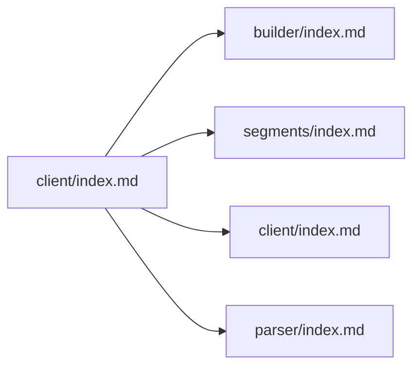

# 🩺 go-hl7 :: client :: Documentation

> The go-hl7 client packages are a Go library for **building**, **sending**, and **parsing** HL7 v2.x messages. Pair them with the [`server`](../server/index.md) package for full coverage.

## 🌱 Why HL7?

Health Level Seven International ("HL7") is the lingua franca for healthcare integrations. Three companies that don't otherwise share infrastructure can still talk to each other:

- 🏥 **Epic** — a premier Electronic Medical Record (EMR) system.
- 🩻 **GE Healthcare** — imaging and biomedical equipment with bundled software.
- 🩺 **Philips Healthcare** — patient monitors, diagnostics, and bedside devices.

When a patient is admitted in Epic, an ADT^A01 needs to flow to the radiology system so the X‑ray modality is ready, and downstream so the lab knows orders are coming. Without HL7, every vendor would need bespoke adapters to every other vendor. With HL7, they all speak one structured text protocol, often over TCP/MLLP.

The `client` packages are the **client side** of that conversation — built so a Go application can produce well‑formed messages and exchange them with a remote HL7 broker.

> ⚠️ **Note**: This library is *not* the world's authority on HL7. For the canonical specification, see [hl7.org](https://www.hl7.org/implement/standards/index.cfm?ref=nav).

## 🧾 Table of Contents

1. [Why HL7?](#-why-hl7)
2. [Solving the divide](#-solving-the-divide)
3. [Documentation layout](#️-documentation-layout)
4. [Keyword definitions](#-keyword-definitions)
5. [Copyright notice](#️-copyright-notice)

---

## 🧩 Solving the divide

This library exists to make HL7 a first‑class citizen of the Go ecosystem — strongly typed, well documented, and free of third‑party dependencies.

| 🎯 What | 🤔 Why |
|---|---|
| Pure Go, standard library only | No supply chain to audit; reproducible builds. |
| **Zero runtime dependencies** | Faster cold starts, smaller container images, easier audits. |
| Typed segment builders (HL7 2.1 → 2.8) | No more hand‑typed `MSH\|^~\&\|...` strings. |
| Built‑in MLLP framing & TLS | Production‑ready transport without bolting on another library. |
| Pluggable outbound queue | In‑memory by default; swap in Redis for multi‑pod deployments. |

---

## 🗂️ Documentation layout

| Section | Purpose |
|---|---|
| 🧱 **[Builder](builder/index.md)** | Construct standardized HL7 messages with the class‑based `hl7.HL7_2_x` builders — versions, MSH-first ordering, usage codes, composites, batches, and validation. |
| 🧬 **[Segments](segments/index.md)** | The full compatibility matrix of every supported segment across HL7 v2.1 → v2.8, plus a per‑segment cheat‑sheet and Caristix links. |
| 🔌 **[Client](client/index.md)** | Connect to a remote HL7 server, send messages, handle ACKs, configure TLS/mTLS, and offload the queue (Redis, RabbitMQ). |
| 🔍 **[Parser](parser/index.md)** | Turn raw HL7 strings (single message, batch, or file) back into `builder.Message` objects. |
| 🏥 **Server docs** | If you also need to **receive** HL7, jump to the [server pages](../server/index.md). |

---

## 📚 Keyword definitions

This library supports medical applications with potential impact on patient care and diagnoses. The terms **MUST**, **MUST NOT**, **REQUIRED**, **SHALL**, **SHALL NOT**, **SHOULD**, **SHOULD NOT**, **RECOMMENDED**, **MAY**, and **OPTIONAL** in the documentation follow [RFC 2119](https://www.rfc-editor.org/rfc/rfc2119) semantics.

> ⚠️ **Capitalization matters.** These keywords carry their RFC 2119 meaning **only when written in ALL CAPS**. The lowercase forms (`must`, `should`, `may`, …) are normal English and are not normative.

- **MUST** / **REQUIRED** / **SHALL** — absolute requirement of the specification.
- **MUST NOT** / **SHALL NOT** — absolute prohibition.
- **SHOULD** / **RECOMMENDED** — there may be valid reasons to deviate, but only after carefully weighing the implications.
- **SHOULD NOT** / **NOT RECOMMENDED** — there may be valid reasons to allow the behavior, again with care.
- **MAY** / **OPTIONAL** — purely optional. Implementations on either side MUST interoperate.

---

## ©️ Copyright notice

Epic, GE, and Philips are registered trademarks of their respective owners. They appear here only as illustrative examples — this project is **not** affiliated with or sponsored by any of them.
