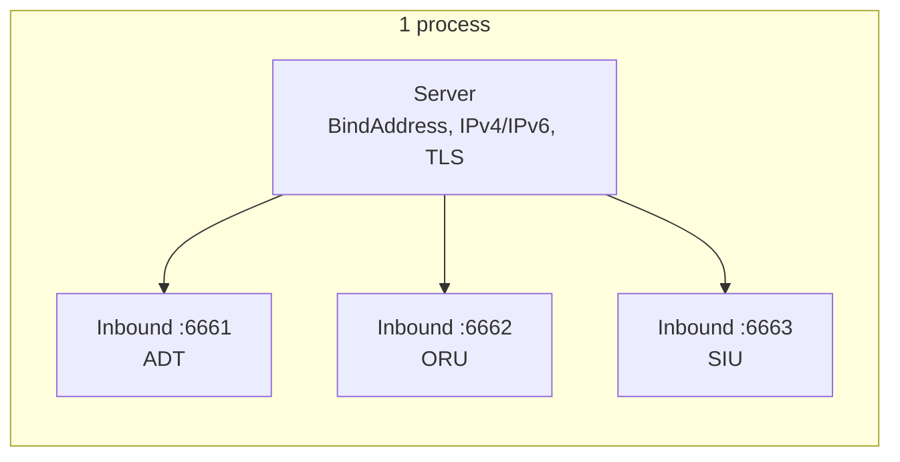

# 🔌 Inbound Listeners

> A single `Server` can host any number of inbound listeners — typically one per HL7 message type / port (ADT on 6661, ORU on 6662, …). Each listener owns its own MSH‑override config and handler.

## 🧾 Table of Contents

1. [Server vs. Inbound](#-server-vs-inbound)
2. [Server options](#-server-options)
3. [Inbound options](#-inbound-options)
4. [The handler](#-the-handler)
5. [Reading the `req`](#-reading-the-req)
6. [Events](#-events)
7. [Closing cleanly](#-closing-cleanly)

---

## 🧱 Server vs. Inbound



`server.NewServer(...)` configures the **process** (bind address, TLS, IPv4/IPv6). `srv.CreateInbound(...)` opens an **individual listening port** with its own handler.

```go
import "github.com/Bugs5382/go-hl7/server"

func ptr[T any](v T) *T { return &v }

// IPv4 only by default (binds 0.0.0.0). Pass nil for the defaults.
srv, _ := server.NewServer(nil)

IB_ADT, _ := srv.CreateInbound(server.ListenerOptions{Port: ptr(6661)}, func(req *server.InboundRequest, res server.ResponseSender) error { /* … */ return nil })
IB_ORU, _ := srv.CreateInbound(server.ListenerOptions{Port: ptr(6662)}, func(req *server.InboundRequest, res server.ResponseSender) error { /* … */ return nil })
```

---

## ⚙️ Server options

`ServerOptions` uses pointer fields so the library can distinguish "not provided" from an explicit value.

```go
srv, _ := server.NewServer(&server.ServerOptions{
    // BindAddress: ptr("0.0.0.0"), // default depends on IPv4/IPv6 (see below)
    Encoding: "utf8",               // default: utf8 (retained for parity)
    IPv4:     ptr(true),            // default: true
    IPv6:     ptr(false),           // default: false (set true alongside IPv4 for dual-stack)
    // TLS: &server.TLSConfig{ /* see TLS docs */ },
})
```

| Field | Type | Default | Purpose |
|---|---|---|---|
| `BindAddress` | `*string` | `0.0.0.0` (or `::` for dual‑stack / IPv6‑only) | Where to bind. Pass an explicit literal — or `"localhost"` — to pin a specific address. |
| `IPv4` | `*bool` | `true` | Accept IPv4 connections. |
| `IPv6` | `*bool` | `false` | Accept IPv6 connections (set alongside `IPv4` for dual‑stack). |
| `Encoding` | `string` | `utf8` | Retained for parity; Go bodies are UTF‑8. |
| `TLS` | `*TLSConfig` | `nil` | Enable TLS / mTLS (see below). |

### 🌐 IPv4 + IPv6 (Dual-Stack)

The server listens on **IPv4 only by default** (`BindAddress: "0.0.0.0"`). Opt into dual-stack by setting both `IPv4` and `IPv6` to `true` — the listener then binds the IPv6 wildcard `::` and accepts traffic from either family. No second listener required.

| Mode | Set this | Default `BindAddress` |
|---|---|---|
| IPv4 only (default) | `IPv4: ptr(true)` (or omit) | `"0.0.0.0"` |
| Dual-stack | `IPv4: ptr(true), IPv6: ptr(true)` | `"::"` |
| IPv6 only | `IPv6: ptr(true)` (alone) | `"::"` |

```go
// IPv4 only on every v4 interface (default)
srv, _ := server.NewServer(nil)

// Dual-stack on every interface
dual, _ := server.NewServer(&server.ServerOptions{IPv4: ptr(true), IPv6: ptr(true)})

// IPv6 only on every v6 interface
v6, _ := server.NewServer(&server.ServerOptions{IPv6: ptr(true)})

// Pin a specific termination address when the host has multiple
onMgmt, _ := server.NewServer(&server.ServerOptions{BindAddress: ptr("10.50.0.4"), IPv4: ptr(true)})
v6Pin, _ := server.NewServer(&server.ServerOptions{BindAddress: ptr("fd12::4"), IPv6: ptr(true)})
```

**Fallback.** When dual-stack is opted in and the kernel refuses the IPv6 wildcard bind (no v6 stack, hardened container, etc.), the listener automatically retries IPv4-only on `0.0.0.0`. Errors that aren't address-family-related (e.g. `EADDRINUSE`) propagate as the regular `error` event.

> 💡 Passing only **one** of `IPv4` / `IPv6` as `true` is treated as exclusive — that family only. Setting both to `false` returns an error from `NewServer`. The `BindAddress` is validated against the chosen family — `localhost` is always allowed.

---

## 🛎️ Inbound options

```go
srv.CreateInbound(
    server.ListenerOptions{
        Port: ptr(6661),                          // required, 0 < port < 65353
        Name: "IB_EPIC_ADT",                      // optional, for logging
        Encoding: "utf8",
        MSHOverrides: map[string]server.MSHOverride{ // see Responses docs
            "3":   server.StringOverride("MY_APP"),
            "9.3": server.StringOverride("ACK"),
        },
    },
    func(req *server.InboundRequest, res server.ResponseSender) error { /* … */ return nil },
)
```

| Option | Type | Purpose |
|---|---|---|
| `Port` | `*int` | TCP port to listen on. Required. `0 < port < 65353`. |
| `Name` | `string` | Human‑readable identifier; auto‑randomized if empty. |
| `Encoding` | `string` | Retained for parity (default utf8). |
| `MSHOverrides` | `map[string]server.MSHOverride` | Per‑field MSH overrides for the auto‑ACK. See [Responses](../responses/index.md). |

---

## 🧠 The handler

`InboundHandler` is `func(req *server.InboundRequest, res server.ResponseSender) error`.

The handler runs **once per parsed message** — even if the frame was a BHS batch or FHS file containing many messages.

```go
srv.CreateInbound(server.ListenerOptions{Port: ptr(6661)}, func(req *server.InboundRequest, res server.ResponseSender) error {
    // 1) Inspect the message.
    msg := req.GetMessage()
    mrn := msg.Get("PID.3").String()

    // 2) Do whatever the system needs.
    if err := persistAdmission(mrn, msg); err != nil {
        return err
    }

    // 3) Acknowledge the sender. (See Responses docs for AR / AE / custom.)
    return res.SendResponse("AA")
})
```

> 💡 **Acknowledge first, work later.** Push the parsed message onto a queue (Redis, RabbitMQ) before returning — you'll keep the sender unblocked and avoid back-pressure during bursts.

---

## 📨 Reading the `req`

| Method | Returns | Notes |
|---|---|---|
| `req.GetMessage()` | `*builder.Message` | The parsed message. Panics with `HL7ListenerError` if missing. |
| `req.GetType()` | `string` | `"message"` / `"batch"` / `"file"` — single MSH, a BHS batch, or an FHS file. |
| `req.GetSocket()` | `net.Conn` | The underlying TCP/TLS socket. Panics with `HL7ListenerError` if the request was constructed without one. |

```go
msg := req.GetMessage()
typ := req.GetType()
sock := req.GetSocket()

fmt.Printf("📨 %s (%s) from %s\n", msg.Get("MSH.10").String(), typ, sock.RemoteAddr())
```

The full reading API (`Get`, `Set`, `AddSegment`, repetitions, sub‑components) lives in the [client parser docs](../../client/parser/index.md) — `req.GetMessage()` returns the same `*builder.Message` type.

---

## 📡 Events

`*Inbound` embeds an event emitter. Register with `On(name, handler)` / `Once(name, handler)`; handlers take a variadic `...any` payload.

| Event | Payload | Fires when… |
|---|---|---|
| `listen` | _none_ | the TCP/TLS server is bound and accepting connections. |
| `client.connect` | `net.Conn` | a new client connects. |
| `client.close` | `bool` (hadError) | a client disconnects. |
| `client.error` | `error` | a per‑connection error occurs (closes the socket). |
| `error` | `error` | the underlying TCP/TLS listener failed to bind. |
| `data.raw` | `string` | a complete MLLP message has been buffered, just before parsing. Useful for debug capture. |
| `data.error` | `error` | a frame couldn't be parsed (malformed HL7, unexpected bytes). |
| `response.sent` | _none_ | an ACK was just written to the socket. |

```go
IB_ADT.On("listen", func(_ ...any) { fmt.Println("🎧 listening") })
IB_ADT.On("client.connect", func(args ...any) { fmt.Println("🤝", args[0]) })
IB_ADT.On("data.raw", func(args ...any) { fmt.Println("📥", len(args[0].(string)), "bytes") })
IB_ADT.On("response.sent", func(_ ...any) { fmt.Println("✅ ACK sent") })
IB_ADT.On("data.error", func(args ...any) { fmt.Println("💥 parse error", args[0]) })
```

---

## 🚪 Closing cleanly

HL7 servers are typically long‑lived — designed to be up at all times. When you do shut down (deploys, scale-down):

```go
_ = IB_ADT.Close()   // close one listener
// or close many:
_ = IB_ADT.Close()
_ = IB_ORU.Close()
```

`Close()` destroys all open client sockets and stops the listening server.
