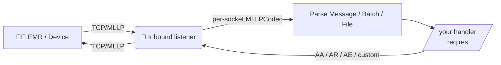
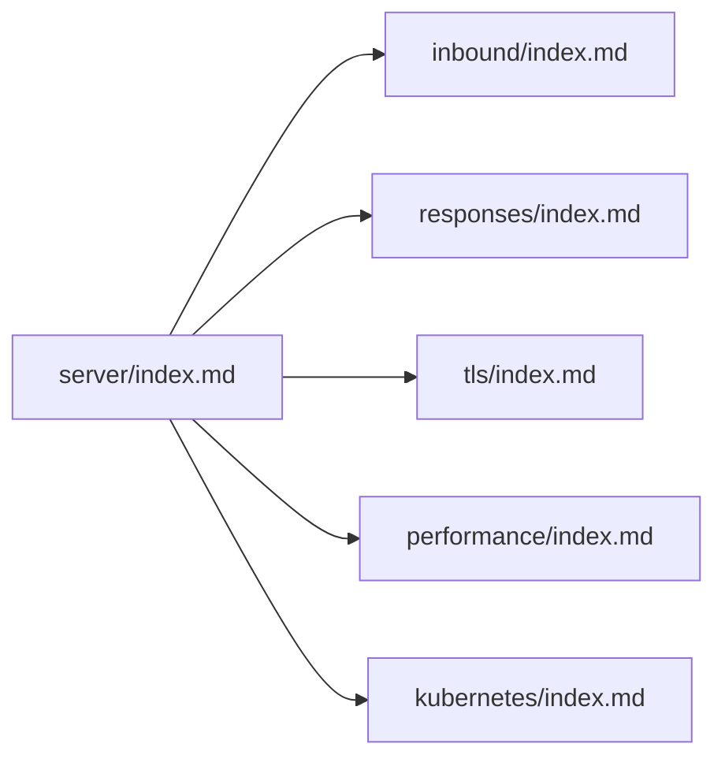

# 🏥 go-hl7 :: server :: Documentation

> The go-hl7 server package accepts HL7 v2.x messages over TCP/MLLP, parses them, and lets your handler reply with auto‑generated or fully custom acknowledgements. It pairs with the [`client`](../client/index.md) packages for full coverage.

## ✨ At a glance

Every connection gets its own `modules.MLLPCodec` so concurrent senders never interleave their byte streams. Your handler receives one parsed `builder.Message` at a time even if the inbound frame is a BHS batch or FHS file.

Each listener is bound to a **required** HL7 version (set per port): an inbound message whose `MSH.12` does not match the listener's version is rejected with an `AR` (Application Reject) ACK and never reaches your handler. Dedicate a port per version.

## 🗂️ Documentation layout

| Section | Purpose |
|---|---|
| 🔌 **[Inbound listeners](inbound/index.md)** | Server / Inbound options (including the **required** per‑listener HL7 version and `AR` rejection of mismatched inbound), request shape, events, multi‑port setups. |
| 📬 **[Responses](responses/index.md)** | Auto ACKs (`SendResponse`), MSH overrides, and **fully custom ACKs** (`SendCustomResponse`). |
| 🔒 **[TLS & mTLS](tls/index.md)** | Server‑auth and mutual‑auth setups, peer-cert inspection, and a cert-generation cheat sheet. |
| ⚡ **[Performance](performance/index.md)** | Throughput notes, scaling tips, and what the inbound counters measure. |
| ☸️ **[Kubernetes](kubernetes/index.md)** | Horizontal listener + worker pods, Redis / RabbitMQ wiring, TLS termination patterns, and sizing. |

## 📚 Keyword definitions

The terms **MUST**, **MUST NOT**, **REQUIRED**, **SHALL**, **SHALL NOT**, **SHOULD**, **SHOULD NOT**, **RECOMMENDED**, **MAY**, and **OPTIONAL** follow [RFC 2119](https://www.rfc-editor.org/rfc/rfc2119) semantics.

> ⚠️ **Capitalization matters.** These keywords carry their RFC 2119 meaning **only when written in ALL CAPS**. The lowercase forms (`must`, `should`, `may`, …) are normal English and are not normative.
