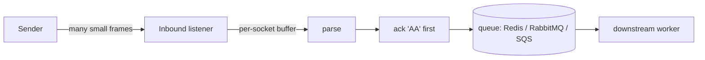

# ⚡ Performance & Throughput

> A practical guide to running the go-hl7 `server` at hospital scale — what the library does for you, what you should do for it, and how to measure.



The golden rule: **acknowledge first, work later.**

---

## 📈 What "high throughput" usually looks like

| Workload | Sustained rate | Burst rate |
|---|---|---|
| ~60,000 ADT/day | ~0.7 msg/s | a few hundred/min |
| ORU result feed | varies | spiky around shift handoffs |
| Discharge/admission audits | low/sustained | end-of-day spikes |

For these patterns the `server` runs comfortably on a single Go process. Goroutine‑per‑connection accept handling keeps concurrent senders fully isolated, and a 200‑message burst completes in well under a second on commodity hardware with zero drops.

---

## 🧩 What the library guarantees

- 🧵 **Per-socket MLLP framing.** Each TCP connection has its own `modules.MLLPCodec`. Concurrent senders don't interleave each other's bytes, and large messages can arrive across many TCP packets without corruption.
- 🤝 **Connection isolation.** A misbehaving client can't poison the parser state of other clients on the same listener.
- 📊 **Stats counters.** `in.TotalReceived()` (frames seen) and `in.TotalMessage()` (parsed messages — incremented per inner message inside batches/files). `in.IsListening()` reports readiness.

```go
import "time"

go func() {
    ticker := time.NewTicker(30 * time.Second)
    defer ticker.Stop()
    for range ticker.C {
        fmt.Printf("📊 received=%d totalMessage=%d\n", IB_ADT.TotalReceived(), IB_ADT.TotalMessage())
        // → received=38221 totalMessage=38275
    }
}()
```

---

## 🛠️ What you should do

### 1. Acknowledge first, work later

Don't do heavy work in the handler. Pop the `Message` onto a queue and let a worker process it.

```go
srv.CreateInbound(server.ListenerOptions{Version: "2.7", Port: ptr(6661)}, func(req *server.InboundRequest, res server.ResponseSender) error {
    if err := queue.Publish(req.GetMessage().String()); err != nil { // milliseconds
        return err
    }
    return res.SendResponse("AA") // sender unblocked
})
```

This minimizes back-pressure on the sender and keeps your goroutines free.

### 2. One port per workflow

It's idiomatic for HL7 environments to dedicate a port per message type:

```go
srv.CreateInbound(server.ListenerOptions{Version: "2.7", Port: ptr(6661), Name: "IB_ADT"}, handleADT)
srv.CreateInbound(server.ListenerOptions{Version: "2.7", Port: ptr(6662), Name: "IB_ORU"}, handleORU)
srv.CreateInbound(server.ListenerOptions{Version: "2.7", Port: ptr(6663), Name: "IB_SIU"}, handleSIU)
```

Each listener has its own handler, MSH overrides, and stats. Routing is implicit by port — they all share the same `Server`.

### 3. Externalize the queue

Don't rely on the in-memory queue inside Kubernetes — pod restarts will drop messages. Use Redis (preferred), RabbitMQ, SQS, or a database.

> 🔐 **Tag messages per listener** if multiple listeners share a queue, so workers don't dequeue the wrong type.

### 4. TLS termination at the edge (when CPU-bound)

If TLS handshakes are the bottleneck (rare, but possible at very high concurrency), terminate at a sidecar (envoy, nginx, AWS NLB+ACM) and run the `server` in plain TCP locally inside the cluster.

### 5. Watch `data.error`

Log `in.On("data.error", ...)`. In healthy production you'll see effectively zero of these; a sudden spike usually means a sender is producing malformed MLLP frames or there's a TCP path corruption issue.

---

## 🧪 Benchmarks you can run yourself

The repo's server test suite includes:

- **Concurrent connections test** — two simultaneous senders pushing interleaved messages over the same listener (verifies the per-socket codec).
- **TCP fragmentation test** — a large MLLP frame written in small chunks (simulates an Epic ADT^A08 over a slow link).
- **Burst test** — a single connection sending many messages back-to-back; asserts no drops within a time ceiling.

Use these as starting points for your own load tests:

```bash
go test ./server/...
```

---

## 🧭 Scaling beyond one process

The `server` is a single-process Go application — you scale it horizontally with multiple pods/instances behind a TCP load balancer. Two notes:

1. **MLLP is connection-oriented**, so the load balancer should distribute *connections*, not packets. Most TCP LBs do this by default.
2. **Sticky sessions are good**. A sender often holds a single TCP connection for the whole shift; routing it to the same backend reduces handshake cost. AWS NLB and HAProxy both support this.

For Kubernetes deployments, see the dedicated [☸️ Kubernetes deployment guide](../kubernetes/index.md) — it covers horizontal listener pods, Redis / RabbitMQ workers, sticky sessions, sizing, and the TLS-termination tradeoff (LB vs. in-app). The [client-side k8s notes](../../client/client/index.md#-scalability--message-reliability-in-kubernetes) cover the symmetric pattern when *sending* HL7 from a pod.
