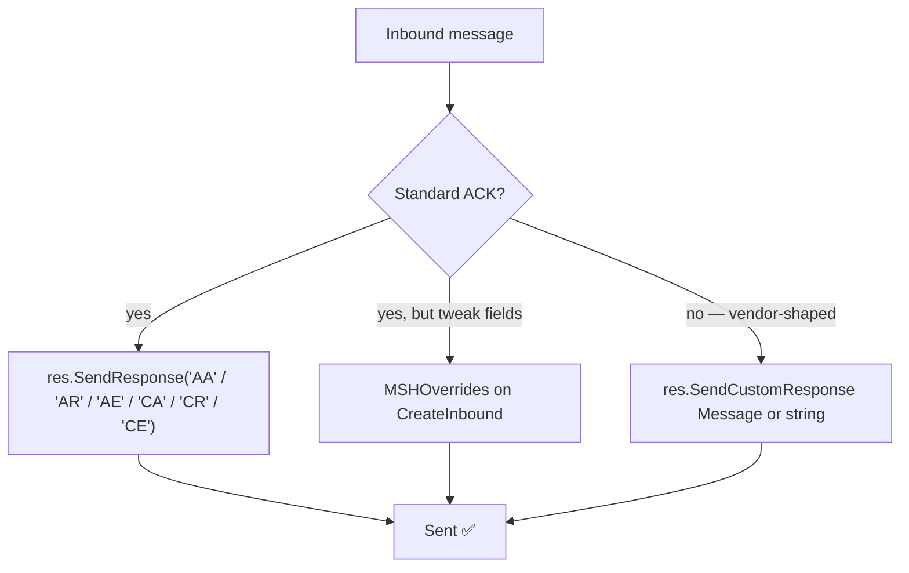

# 📬 Responses (ACKs)

> Three ways to reply: standard ACK with `SendResponse`, MSH overrides on the auto‑generated ACK, or fully verbatim with `SendCustomResponse`.



---

## 🧾 Table of Contents

1. [The `ResponseSender`](#-the-responsesender)
2. [Standard ACK (`SendResponse`)](#-standard-ack-sendresponse)
3. [MSH field overrides](#-msh-field-overrides)
4. [Custom ACK (`SendCustomResponse`)](#-custom-ack-sendcustomresponse)
5. [`GetAckMessage()` after sending](#-getackmessage-after-sending)
6. [Writing through the codec directly](#-writing-through-the-codec-directly)

---

## 🧩 The `ResponseSender`

The handler's `res` argument is a `server.ResponseSender`:

```go
type ResponseSender interface {
    GetAckMessage() *builder.Message  // the ACK that was sent (nil before send)
    GetCodec() *modules.MLLPCodec
    GetSocket() net.Conn
    SendResponse(ackType string) error
    SendCustomResponse(message any) error
}
```

---

## 🤝 Standard ACK (`SendResponse`)

```go
_ = res.SendResponse("AA") // Application Accept
_ = res.SendResponse("AR") // Application Reject
_ = res.SendResponse("AE") // Application Error
_ = res.SendResponse("CA") // Commit Accept   (HL7 ≥ 2.2)
_ = res.SendResponse("CR") // Commit Reject   (HL7 ≥ 2.2)
_ = res.SendResponse("CE") // Commit Error    (HL7 ≥ 2.2)
```

The library auto-generates a syntactically correct ACK by:

- Swapping `MSH.5` ↔ `MSH.3` and `MSH.6` ↔ `MSH.4` (sender/receiver flipped).
- Setting `MSH.7` to "now".
- Using `ACK^<EventCode>` for `MSH.9` (or just `ACK` on 2.1).
- Echoing the original `MSH.10` into `MSA.2`.
- Reusing the inbound `MSH.11` and `MSH.12`.

Resulting ACK example for an inbound `ADT^A01` with control id `MSG00001` on 2.5:

```text
MSH|^~\&|RECV|RFAC|EPIC|HOSP|20240101000005||ACK^A01|97f23ad1|P|2.5
MSA|AA|MSG00001
```

> ⚠️ **Version gate.** `CA` / `CR` / `CE` are valid only on HL7 ≥ 2.2 (the inbound `MSH.12` decides). If the inbound message is `2.1`, the library refuses and falls back to an `AE` ACK. `AA` / `AR` / `AE` are universal.

---

## 🧩 MSH field overrides

When the auto-ACK is *almost* right but a few MSH fields need tweaking, set `MSHOverrides` on the listener. Each entry is either a literal value (`server.StringOverride`) or a callback that receives the inbound `*builder.Message` (`server.FuncOverride`):

```go
import "github.com/Bugs5382/go-hl7/client/builder"

srv.CreateInbound(
    server.ListenerOptions{
        Version: "2.7",
        Port:    ptr(3000),
        MSHOverrides: map[string]server.MSHOverride{
            "3":   server.StringOverride("MY_APP"),                                          // literal
            "9.3": server.StringOverride("ACK"),                                             // composite trigger
            "12":  server.FuncOverride(func(m *builder.Message) string { return m.Get("MSH.12").String() }), // copy from inbound
            "18":  server.StringOverride("UNICODE UTF-8"),                                   // charset
        },
    },
    func(req *server.InboundRequest, res server.ResponseSender) error {
        return res.SendResponse("AA")
    },
)
```

The override key is the MSH field path (e.g. `"3"`, `"9.3"`), applied to the ACK as `MSH.<key>`.

> ❗ Overrides apply only to `SendResponse(...)`. They are intentionally skipped by `SendCustomResponse(...)` — the whole point of a custom ACK is that *you* control every byte.

---

## 🎯 Custom ACK (`SendCustomResponse`)

Some receivers expect vendor-shaped ACKs:

- additional `MSA` fields (`MSA.3`, `MSA.6`),
- explicit `ERR` segments,
- alternate `MSH.3` / `MSH.4` even when the message direction would normally swap,
- custom Z-segments.

`SendCustomResponse` writes the message you provide **verbatim** through the MLLP codec. No validation, no field swapping, no overrides. It accepts a `*builder.Message` **or** a raw HL7 string.

```go
import (
    "strings"
    "time"

    "github.com/Bugs5382/go-hl7/client/builder"
    "github.com/Bugs5382/go-hl7/client/utils"
)

srv.CreateInbound(server.ListenerOptions{Version: "2.7", Port: ptr(3000)}, func(req *server.InboundRequest, res server.ResponseSender) error {
    original := req.GetMessage()
    ctrlID := original.Get("MSH.10").String()

    text := strings.Join([]string{
        "MSH|^~\\&|MY_APP|MY_FAC|EPIC|HOSP|" + utils.CreateHL7Date(time.Now(), "") + "||ACK^A01|RESP_" + ctrlID + "|P|2.5",
        "MSA|AA|" + ctrlID + "|All good|||MY_VENDOR_OK",
        "ERR|||0^Message accepted^HL70357|I",
    }, "\r")

    ack, err := builder.NewMessage(builder.MessageOptions{Text: text})
    if err != nil {
        return err
    }
    return res.SendCustomResponse(ack) // a *builder.Message
})
```

The string variant is also supported:

```go
return res.SendCustomResponse("MSH|^~\\&|...\rMSA|AA|...")
```

> 💡 **When to use which?** Reach for `SendResponse` first — it's compact and follows the spec. Use `MSHOverrides` when one or two MSH fields must look a particular way. Reach for `SendCustomResponse` when the receiver expects a layout the auto-generator can't produce (extra segments, vendor MSA suffixes, etc.). The custom message becomes `res.GetAckMessage()` afterwards.

---

## 🪞 `GetAckMessage()` after sending

After either `SendResponse` or `SendCustomResponse`, the ACK is stored on the response object and accessible via:

```go
ack := res.GetAckMessage()
fmt.Println(ack.Get("MSA.1").String())  // "AA"
fmt.Println(ack.Get("MSH.10").String()) // ACK control id
```

This is handy for logging / observability — you can record the exact bytes you replied with without re-deriving them.

---

## 🛠️ Writing through the codec directly

If you need full control (custom framing, instrumentation hooks, a hand-rolled ACK that bypasses the `SendResponse`/`SendCustomResponse` paths), both the per-socket codec and the socket are exposed on `res`:

```go
import "github.com/Bugs5382/go-hl7/client/modules"

srv.CreateInbound(server.ListenerOptions{Version: "2.7", Port: ptr(3000)}, func(req *server.InboundRequest, res server.ResponseSender) error {
    codec := res.GetCodec()  // *modules.MLLPCodec
    sock := res.GetSocket()  // net.Conn

    ack := /* construct an HL7 string yourself */ "MSH|^~\\&|...\rMSA|AA|..."
    if err := codec.SendMessage(sock, ack); err != nil { // frames as <VT>…<FS><CR>
        return err
    }
    auditLog.Info("ack written")
    return nil
})
```

> 🚨 Prefer `SendCustomResponse` for verbatim ACKs — it stores the message on `res.GetAckMessage()` for you. Drop down to the raw codec only when you genuinely need to bypass the response object. `MLLPCodec.SendMessage(w io.Writer, message string)` is the same per-connection codec the framework uses, so framing stays consistent.
