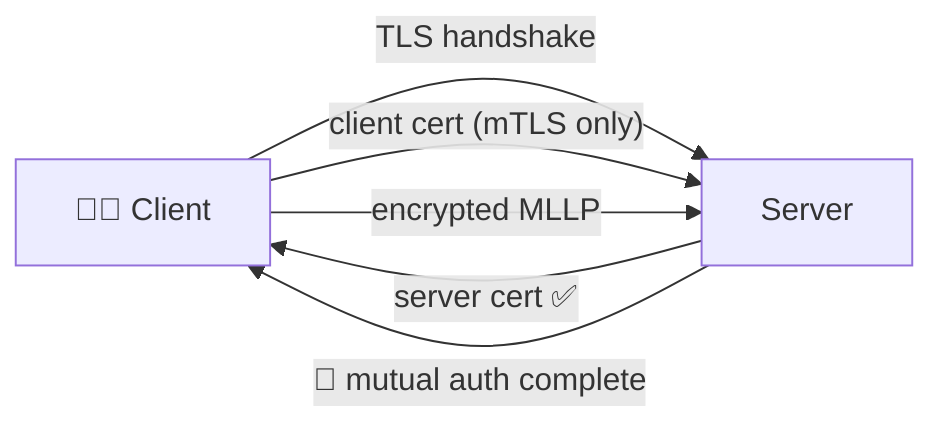

# 🔒 TLS & 🛡️ Mutual TLS (mTLS)

> Hospitals frequently require encrypted transport — and increasingly require **client certificate authentication** (mTLS) too. The `server` package supports both with the same `TLS` option.



## 🧾 Table of Contents

1. [Server-auth TLS](#-server-auth-tls)
2. [Mutual TLS](#-mutual-tls)
3. [Inspecting the peer certificate](#-inspecting-the-peer-certificate)
4. [Certificate generation cheat sheet](#-certificate-generation-cheat-sheet)
5. [Common pitfalls](#-common-pitfalls)

---

## 🔐 Server-auth TLS

The client validates *your* certificate; you don't ask for theirs. Set `TLS` on `ServerOptions` with a PEM `Cert` + `Key`:

```go
import (
    "os"

    "github.com/Bugs5382/go-hl7/server"
)

func ptr[T any](v T) *T { return &v }

key, _ := os.ReadFile("certs/server-key.pem")
crt, _ := os.ReadFile("certs/server-crt.pem")

srv, _ := server.NewServer(&server.ServerOptions{
    TLS: &server.TLSConfig{Key: key, Cert: crt},
})

srv.CreateInbound(server.ListenerOptions{Version: "2.7", Port: ptr(6661)}, func(req *server.InboundRequest, res server.ResponseSender) error {
    return res.SendResponse("AA")
})
```

Everything else (listeners, handlers, ACKs) works identically — the package simply swaps the underlying socket from a plain TCP `net.Conn` to a `*tls.Conn`. `req.GetSocket()` returns the TLS connection so you can read peer details.

---

## 🛡️ Mutual TLS

Tell the server to **demand** a client certificate, validate it against a list of trusted CAs, and reject anyone else. Set `RequestCert` and a trusted‑CA bundle:

```go
key, _ := os.ReadFile("certs/server-key.pem")
crt, _ := os.ReadFile("certs/server-crt.pem")
ca, _ := os.ReadFile("certs/trusted-client-ca.pem")

srv, _ := server.NewServer(&server.ServerOptions{
    TLS: &server.TLSConfig{
        // 🔑 Server identity
        Key:  key,
        Cert: crt,

        // 🤝 Demand a client certificate, and drop the connection if it
        //    isn't signed by one of the CAs in the bundle.
        RequestCert: true,
        CA:          ca,
    },
})

srv.CreateInbound(server.ListenerOptions{Version: "2.7", Port: ptr(6661)}, func(req *server.InboundRequest, res server.ResponseSender) error {
    return res.SendResponse("AA")
})
```

| Field | Effect |
|---|---|
| `Cert` + `Key` | Server identity — what every connecting client validates. |
| `RequestCert` | Ask the client to present a certificate during the handshake. |
| `CA` | The set of trusted client‑CA certificates (PEM bundle). Multiple CAs in the bundle are fine. |

> 🚨 **Production**: pair `RequestCert` with proper CA trust so unsigned clients can't connect. Use a permissive setup only for local development.

---

## 👤 Inspecting the peer certificate

Once the handshake completes, the peer certificate is available via the TLS connection returned by `req.GetSocket()`:

```go
import "crypto/tls"

srv.CreateInbound(server.ListenerOptions{Version: "2.7", Port: ptr(6661)}, func(req *server.InboundRequest, res server.ResponseSender) error {
    if tc, ok := req.GetSocket().(*tls.Conn); ok {
        state := tc.ConnectionState()
        if len(state.PeerCertificates) > 0 {
            peer := state.PeerCertificates[0]
            fmt.Println("🤝 mTLS peer:", peer.Subject.CommonName, "issued by", peer.Issuer.CommonName)

            // Reject programmatically (in addition to RequestCert) if you
            // need fine-grained checks like CN allow-listing:
            if peer.Subject.CommonName != "expected-client-cn" {
                _ = tc.Close()
                return nil
            }
        }
    }
    return res.SendResponse("AA")
})
```

`tls.Conn.ConnectionState().PeerCertificates` is empty if the peer didn't present a cert — combined with `RequestCert: true` and a CA bundle you'll never see that case in practice, but a defensive check is cheap.

---

## 🧾 Certificate generation cheat sheet

For local testing, OpenSSL is the easiest tool. The commands below produce a self-signed CA, a server cert signed by that CA, and a client cert signed by the same CA. The repo's `certs/` folder follows this layout.

```bash
# 1) CA
openssl genrsa -out server-ca-key.pem 4096
openssl req -x509 -new -key server-ca-key.pem -days 3650 -out server-ca-crt.pem \
  -subj "/CN=go-hl7 dev CA"

# 2) Server cert
openssl genrsa -out server-key.pem 4096
openssl req -new -key server-key.pem -out server-csr.pem \
  -subj "/CN=hl7.example.local"
openssl x509 -req -in server-csr.pem \
  -CA server-ca-crt.pem -CAkey server-ca-key.pem -CAcreateserial \
  -out server-crt.pem -days 825 -sha256

# 3) Client cert (used by the connecting client; the server validates against the same CA)
openssl genrsa -out client-key.pem 4096
openssl req -new -key client-key.pem -out client-csr.pem \
  -subj "/CN=client-app-1"
openssl x509 -req -in client-csr.pem \
  -CA server-ca-crt.pem -CAkey server-ca-key.pem -CAcreateserial \
  -out client-crt.pem -days 825 -sha256
```

In production these come from your hospital PKI / a real CA — never commit private keys.

> 🤝 The matching **client-side** mTLS configuration lives in the [`client`](../../client/client/index.md#-mutual-tls-mtls) package. The two ends MUST agree on which CA(s) issue valid certs in each direction.

---

## ⚠️ Common pitfalls

| Symptom | Likely cause |
|---|---|
| `tls: client didn't provide a certificate` | `RequestCert: true` but client didn't present one. |
| `x509: certificate signed by unknown authority` | Client/server cert chain isn't fully presented; concatenate intermediates into `Cert`. |
| Connections closed immediately | Wrong CA in `CA`, or the client's CA isn't in the bundle you provided. |
| Works locally, fails in prod | `RejectUnauthorized: ptr(false)` on the client masking a real cert problem in dev. |
| `PeerCertificates` is empty | `RequestCert: true` was missing — you can't read what you never asked for. |

> 💡 Capture the raw frame on `data.raw` and the parse error on `data.error` while debugging — they often reveal a TLS misconfiguration before the HL7 layer even sees a frame.
