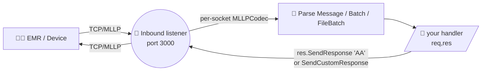
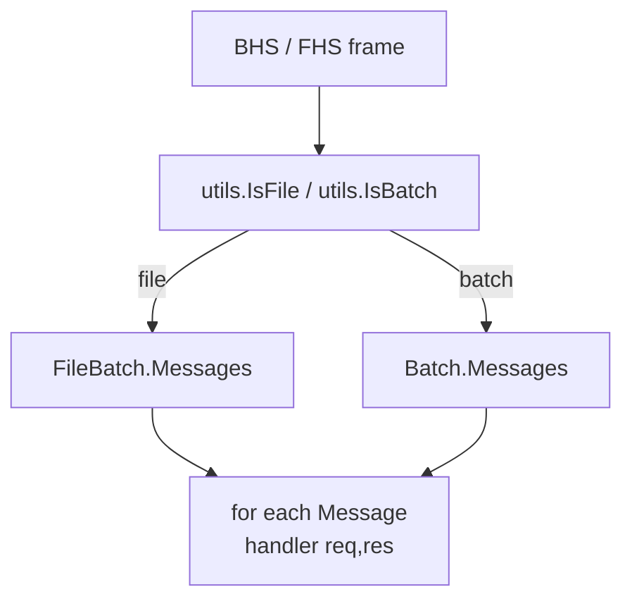

# 🏥 go-hl7 :: server

> An HL7 listener for Go — accept, parse, acknowledge, and route HL7 v2.x messages over MLLP.

The `server` package is a lightweight, dependency‑light TCP/MLLP listener built for high‑throughput hospital integrations. It accepts properly framed HL7 messages, parses them with the [`client`](../client) packages, hands them to your handler, and lets you reply with auto‑generated or fully custom ACKs.

```go
import "github.com/Bugs5382/go-hl7/server"
```

## ✨ Features

- 🧵 **MLLP framing built in** — handles `<VT>…<FS><CR>` framing, including TCP fragmentation across many reads.
- 🔁 **Per‑connection codec** — concurrent clients never interleave each other's buffers.
- 🤝 **Auto ACK** — send `AA` / `AR` / `AE` / `CA` / `CR` / `CE` with a single call, or build your own.
- 🧩 **Custom ACK** — `SendCustomResponse(...)` writes a verbatim, vendor‑shaped acknowledgement.
- 🛡️ **TLS + mTLS** — both server‑auth and mutual‑auth modes are first‑class.
- 🧱 **Override MSH fields** — set static or callback‑computed values on every reply.
- 🔌 **Socket access** — `req.GetSocket()` for `LocalAddr`, `RemoteAddr`, etc.
- ⚡ **Tiny dep tree** — only depends on its sister `client` packages and the standard library.

## 📦 Install

```sh
go get github.com/Bugs5382/go-hl7
```

The only non‑stdlib dependency is the [`client`](../client) packages — they produce the ACK objects and parse incoming MLLP frames.

> 🟢 **Requires Go ≥ 1.26.**

## 🧾 Table of Contents

1. [Quick Start](#-quick-start)
2. [How it Works](#-how-it-works)
3. [Server Options](#-server-options)
4. [Inbound Listener Options](#-inbound-listener-options)
5. [Reading the Request](#-reading-the-request)
6. [Sending an ACK](#-sending-an-ack)
   - [Standard ACK (`SendResponse`)](#standard-ack-sendresponse)
   - [Custom ACK (`SendCustomResponse`)](#custom-ack-sendcustomresponse)
   - [MSH Field Overrides](#msh-field-overrides)
7. [Batches & File Batches](#-batches--file-batches)
8. [TLS](#-tls)
9. [Mutual TLS (mTLS)](#-mutual-tls-mtls)
10. [Concurrent Connections & MLLP Framing](#-concurrent-connections--mllp-framing)
11. [Performance & Throughput](#-performance--throughput)
12. [Events](#-events)
13. [Keyword Definitions](#-keyword-definitions)
14. [License](#-license)

---

## 🚀 Quick Start

```go
package main

import (
	"fmt"

	"github.com/Bugs5382/go-hl7/server"
)

func ptr[T any](v T) *T { return &v }

func main() {
	srv, _ := server.NewServer(&server.ServerOptions{BindAddress: ptr("0.0.0.0")})

	in, _ := srv.CreateInbound(
		server.ListenerOptions{Port: ptr(3000)},
		func(req *server.InboundRequest, res server.ResponseSender) error {
			message := req.GetMessage()
			fmt.Println("⬅️  received", message.Get("MSH.10").String())

			// Tell the sender we accepted it.
			return res.SendResponse("AA")
		},
	)
	defer in.Close()

	in.On("listen", func(_ ...any) { fmt.Println("🎧 listening on :3000") })

	select {} // keep the process alive
}
```

`NewServer` accepts `*ServerOptions` (pass `nil` for the defaults: IPv4‑only on `0.0.0.0`). The handler signature is `func(req *InboundRequest, res ResponseSender) error`; returning an error surfaces it as a `data.error` event.

A minimal **incoming** ADT^A01 looks like this on the wire (MLLP framing shown as `<VT>` / `<FS>` / `<CR>`):

```text
<VT>MSH|^~\&|EPIC|HOSP|RECV|RFAC|20240101000000||ADT^A01|MSG00001|P|2.5
EVN|A01|20240101000000
PID|1||MRN12345^^^HOSP^MR||DOE^JANE^A||19800101|F<CR><FS><CR>
```

…and the auto‑generated `AA` reply:

```text
<VT>MSH|^~\&|RECV|RFAC|EPIC|HOSP|20240101000005||ACK^A01|97f23ad1|P|2.5
MSA|AA|MSG00001<CR><FS><CR>
```

---

## 🧭 How it Works



Each TCP connection gets **its own** `modules.MLLPCodec` instance. Bytes accumulate across reads until a complete `<VT>…<FS><CR>` frame is seen, and only then is the message handed to your handler. This keeps concurrent senders isolated and makes large messages (Epic OBX^TX records, base64 PDFs, etc.) safe even when the OS chops them into many TCP packets.

---

## ⚙️ Server Options

```go
srv, err := server.NewServer(&server.ServerOptions{ /* ... */ })
```

`ServerOptions` uses pointer fields so the library can distinguish "not provided" from an explicit value (use a small `func ptr[T any](v T) *T { return &v }` helper):

| Field | Type | Default | Purpose |
|---|---|---|---|
| `BindAddress` | `*string` | `0.0.0.0` (or `::` for dual‑stack / IPv6‑only) | Where to bind. Pass an explicit literal — or `"localhost"` — to pin a specific address. |
| `IPv4` | `*bool` | `true` | Accept IPv4 connections. |
| `IPv6` | `*bool` | `false` | Accept IPv6 connections (set alongside `IPv4` for dual‑stack). |
| `Encoding` | `string` | `utf8` | Retained for parity; Go bodies are UTF‑8. |
| `TLS` | `*TLSConfig` | `nil` | Enable TLS / mTLS (see below). |

### 🌐 IPv4 + IPv6 (Dual-Stack)

The server listens on **IPv4 only by default** (`BindAddress: "0.0.0.0"`). Opt into dual‑stack by setting both `IPv4` and `IPv6` to `true` — the listener then binds the IPv6 wildcard `::` and accepts traffic from either family.

```go
// IPv4 only (default): listens on 0.0.0.0
srv, _ := server.NewServer(nil)

// Dual-stack (opt-in): listens on ::
dual, _ := server.NewServer(&server.ServerOptions{IPv4: ptr(true), IPv6: ptr(true)})

// IPv6 only: bindAddress defaults to ::
v6, _ := server.NewServer(&server.ServerOptions{IPv6: ptr(true)})

// Pin a specific address when the host has multiple
onMgmt, _ := server.NewServer(&server.ServerOptions{BindAddress: ptr("10.50.0.4"), IPv4: ptr(true)})
```

**Fallback.** When dual‑stack is opted in and the kernel refuses the IPv6 wildcard bind (no v6 stack, hardened container, etc.), the listener automatically retries IPv4‑only on `0.0.0.0`.

> 💡 Passing only **one** of `IPv4` / `IPv6` as `true` is treated as exclusive — that family only. Setting both to `false` returns an error from `NewServer`. The `BindAddress` is validated against the chosen family.

---

## 🛎️ Inbound Listener Options

A single `Server` can host any number of listeners on different ports.

```go
in, err := srv.CreateInbound(props server.ListenerOptions, handler server.InboundHandler)
```

`InboundHandler` is `func(req *InboundRequest, res ResponseSender) error`.

| `ListenerOptions` field | Type | Purpose |
|---|---|---|
| `Port` | `*int` | Required. `0 < port < 65353`. |
| `Name` | `string` | Optional human‑readable name for logging; auto‑randomized if empty. |
| `Encoding` | `string` | Retained for parity (default utf8). |
| `MSHOverrides` | `map[string]server.MSHOverride` | Per‑field MSH overrides applied to the auto‑generated ACK. |

The handler gets called **once per parsed message**, even when the inbound frame is a batch (BHS) or file (FHS) containing many messages.

---

## 📨 Reading the Request

```go
srv.CreateInbound(server.ListenerOptions{Port: ptr(3000)},
	func(req *server.InboundRequest, res server.ResponseSender) error {
		msg := req.GetMessage()    // *builder.Message from the client package
		typ := req.GetType()       // "message" | "batch" | "file"
		sock := req.GetSocket()    // 🔌 the underlying net.Conn

		// Inspect any field, sub-field, or sub-sub-field:
		mrn := msg.Get("PID.3").String()
		lastName := msg.Get("PID.5.1").String()
		version := msg.Get("MSH.12").String() // 2.5, 2.7, …
		_ = lastName

		// Use the socket for connection-aware logic:
		fmt.Printf("📨 %s from %s\n", mrn, sock.RemoteAddr())
		return res.SendResponse("AA")
	},
)
```

| Method | Returns | Notes |
|---|---|---|
| `req.GetMessage()` | `*builder.Message` | Full parsed message. Panics with `HL7ListenerError` if missing. |
| `req.GetType()` | `string` | `"message"` / `"batch"` / `"file"` — single MSH, a BHS batch, or an FHS file. |
| `req.GetSocket()` | `net.Conn` | Panics with `HL7ListenerError` if the request was created without one. |

See the [client parser docs](../client/README.md#-parsing-replies) for the full Message / Batch / FileBatch reading API.

---

## 📬 Sending an ACK

The handler's `res` is a `ResponseSender`:

```go
type ResponseSender interface {
	GetAckMessage() *builder.Message  // the ACK that was sent (nil before send)
	GetCodec() *modules.MLLPCodec
	GetSocket() net.Conn
	SendResponse(ackType string) error
	SendCustomResponse(message any) error
}
```

### Standard ACK (`SendResponse`)

The library mints an HL7‑spec ACK with sender/receiver swapped, the original `MSH.10` echoed in `MSA.2`, and an `MSH.9` of `ACK^<EventCode>`.

```go
_ = res.SendResponse("AA") // Application Accept
_ = res.SendResponse("AR") // Application Reject
_ = res.SendResponse("AE") // Application Error

// 2.2+ commit-level ACKs:
_ = res.SendResponse("CA") // Commit Accept
_ = res.SendResponse("CR") // Commit Reject
_ = res.SendResponse("CE") // Commit Error

ack := res.GetAckMessage() // the *builder.Message that was sent
_ = ack
```

> ⚠️ **Version gate.** `CA` / `CR` / `CE` are valid only for HL7 ≥ 2.2 (the inbound `MSH.12` decides). If the inbound message is `2.1`, the library refuses and falls back to an `AE` ACK. `AA` / `AR` / `AE` are valid on every version.

### Custom ACK (`SendCustomResponse`)

When the receiving system expects a vendor‑shaped acknowledgement (extra `MSA` fields, custom `ERR` segments, alternate `MSH.3`/`MSH.4`, etc.), build the message yourself and ship it verbatim. It accepts a `*builder.Message` **or** a raw HL7 string:

```go
import (
	"strings"
	"time"

	"github.com/Bugs5382/go-hl7/client/builder"
	"github.com/Bugs5382/go-hl7/client/utils"
)

srv.CreateInbound(server.ListenerOptions{Port: ptr(3000)},
	func(req *server.InboundRequest, res server.ResponseSender) error {
		original := req.GetMessage()
		ctrlID := original.Get("MSH.10").String()

		text := strings.Join([]string{
			"MSH|^~\\&|MY_APP|MY_FAC|EPIC|HOSP|" + utils.CreateHL7Date(time.Now(), "") + "||ACK^A01|RESP_" + ctrlID + "|P|2.5",
			"MSA|AA|" + ctrlID + "|All good|||MY_VENDOR_OK",
			"ERR|||0^Message accepted^HL70357|I",
		}, "\r")

		ack, err := builder.NewMessage(builder.MessageOptions{Text: text})
		if err != nil {
			return err
		}
		return res.SendCustomResponse(ack) // a *builder.Message
		// -- or -- res.SendCustomResponse(text) // a raw string
	},
)
```

`SendCustomResponse` performs **no MSA‑1 validation, no MSH overrides, no auto‑swap of sender/receiver**. You are in full control of the bytes on the wire — that is the whole point. The custom message becomes `res.GetAckMessage()` afterwards.

### MSH Field Overrides

When the auto‑ACK is *almost* right but a couple of MSH fields need tweaking, set `MSHOverrides` on `ListenerOptions`. Each entry is either a literal value (`server.StringOverride`) or a callback that receives the inbound `*builder.Message` (`server.FuncOverride`):

```go
srv.CreateInbound(
	server.ListenerOptions{
		Port: ptr(3000),
		MSHOverrides: map[string]server.MSHOverride{
			"3":   server.StringOverride("MY_APP"),
			"9.3": server.StringOverride("ACK"),
			"12":  server.FuncOverride(func(m *builder.Message) string { return m.Get("MSH.12").String() }),
			"18":  server.StringOverride("UNICODE UTF-8"),
		},
	},
	func(req *server.InboundRequest, res server.ResponseSender) error {
		return res.SendResponse("AA")
	},
)
```

The override key is the MSH field path (e.g. `"3"`, `"9.3"`), applied to the ACK as `MSH.<key>`. Overrides apply only to `SendResponse(...)` — they are intentionally skipped by `SendCustomResponse(...)`.

---

## 📚 Batches & File Batches

If the sender ships a BHS‑wrapped batch or an FHS‑wrapped file, **the listener invokes your handler once per inner message** (each with its own `req` and `res`). You don't need any extra code — `req.GetType()` simply returns `"batch"` or `"file"` instead of `"message"`.



---

## 🔒 TLS

For **server‑authenticated** TLS (the client validates your cert, but not vice‑versa), set `TLS` on `ServerOptions` with a PEM `Cert` + `Key`:

```go
import "os"

key, _ := os.ReadFile("certs/server-key.pem")
crt, _ := os.ReadFile("certs/server-crt.pem")

srv, _ := server.NewServer(&server.ServerOptions{
	TLS: &server.TLSConfig{Key: key, Cert: crt},
})
```

Everything else (listeners, handlers, ACKs) works identically — the package simply swaps the underlying socket from a plain TCP `net.Conn` to a `*tls.Conn`. `req.GetSocket()` returns the TLS connection so you can read peer details.

---

## 🛡️ Mutual TLS (mTLS)

Many hospital environments require **client‑certificate authentication** in addition to server certs. Set `RequestCert` and a trusted‑CA bundle:

```go
key, _ := os.ReadFile("certs/server-key.pem")
crt, _ := os.ReadFile("certs/server-crt.pem")
ca, _  := os.ReadFile("certs/trusted-client-ca.pem")

srv, _ := server.NewServer(&server.ServerOptions{
	TLS: &server.TLSConfig{
		Key:         key, // 🔑 server identity
		Cert:        crt,
		CA:          ca,  // 🤝 trusted client-CA bundle
		RequestCert: true,
	},
})

srv.CreateInbound(server.ListenerOptions{Port: ptr(6661)},
	func(req *server.InboundRequest, res server.ResponseSender) error {
		// You can inspect the peer via the TLS connection:
		if tc, ok := req.GetSocket().(*tls.Conn); ok {
			state := tc.ConnectionState()
			if len(state.PeerCertificates) > 0 {
				fmt.Println("🤝 mTLS peer:", state.PeerCertificates[0].Subject.CommonName)
			}
		}
		return res.SendResponse("AA")
	},
)
```

| Field | What it does |
|---|---|
| `Cert` + `Key` | Server identity — what every connecting client validates. |
| `RequestCert` | Ask the client to present a certificate during the handshake. |
| `CA` | The set of trusted client‑CA certificates (PEM bundle). |

> 🚨 In production, pair `RequestCert` with proper CA trust so unsigned clients can't connect. Use a permissive setup only for local development.

---

## 🧩 Concurrent Connections & MLLP Framing

Every connection gets its own `modules.MLLPCodec`. That matters because:

1. Two simultaneous senders won't have their byte streams concatenated mid‑frame.
2. A single large message can arrive over **dozens** of TCP packets, and the codec buffers correctly until it sees `<FS><CR>`.

You normally never touch the codec — but if you need to write back through the same socket from a custom handler, both the codec and the socket are exposed on `res`:

```go
codec := res.GetCodec()  // *modules.MLLPCodec
sock := res.GetSocket()  // net.Conn
_ = codec.SendMessage(sock, customString)
```

---

## ⚡ Performance & Throughput

For typical HL7 traffic patterns (e.g. **~60,000 ADT messages/day ≈ 0.7 msg/s sustained**, with bursts to a few hundred per minute), the server runs comfortably on a single Go process. Goroutine‑per‑connection accept handling keeps concurrent senders fully isolated.

Recommendations for higher‑throughput deployments:

- 🚀 **Multiple ports per workflow.** Dedicate a port per message type (e.g. ADT on 6661, ORU on 6662). Call `srv.CreateInbound(...)` once per port — they all share the same `Server`.
- 📦 **Don't do heavy work in the handler.** Acknowledge first (`res.SendResponse("AA")`), then push the parsed `Message` onto a queue for downstream processing. This minimizes back‑pressure on the sender.
- 🧮 **Use TLS termination at the edge** if CPU is the bottleneck — a sidecar handling TLS lets you keep the server in plain TCP locally.
- 🎯 **Monitor the inbound counters** — `in.TotalReceived()` (frames) and `in.TotalMessage()` (parsed messages) are incremented in real time. `in.IsListening()` reports readiness.

> 💡 If you ever see `data.error` events, your sender may be producing malformed MLLP frames or the TCP path is dropping bytes. Log them — they're rare in practice.

---

## 📡 Events

`*Inbound` embeds an event emitter. Register with `On(name, handler)` / `Once(name, handler)`; handlers take a variadic `...any` payload.

| Event | Payload | When |
|---|---|---|
| `listen` | _none_ | The TCP/TLS server bound and is accepting connections. |
| `client.connect` | `net.Conn` | A new client connected. |
| `client.close` | `bool` (hadError) | A client disconnected. |
| `client.error` | `error` | A per‑connection error. |
| `error` | `error` | The underlying TCP/TLS listener failed to bind. |
| `data.raw` | `string` | The full de‑framed payload, just before parsing. |
| `data.error` | `error` | A frame couldn't be parsed (malformed HL7, etc.). |
| `response.sent` | _none_ | An ACK was just written to the socket. |

```go
in.On("client.connect", func(args ...any) { fmt.Println("🤝", args[0]) })
in.On("data.raw", func(args ...any) { fmt.Println("📥", len(args[0].(string)), "bytes") })
in.On("response.sent", func(_ ...any) { fmt.Println("✅ ACK sent") })
in.On("data.error", func(args ...any) { fmt.Println("💥 parse error", args[0]) })
```

---

## 📚 Keyword Definitions

This library supports medical applications with potential impact on patient care and diagnoses. The terms **MUST**, **MUST NOT**, **REQUIRED**, **SHALL**, **SHALL NOT**, **SHOULD**, **SHOULD NOT**, **RECOMMENDED**, **MAY**, and **OPTIONAL** in the documentation follow [RFC 2119](https://www.rfc-editor.org/rfc/rfc2119) semantics.

> ⚠️ **Capitalization matters.** These keywords carry their RFC 2119 meaning **only when written in ALL CAPS**.

## 🔗 See Also

- 🧱 [`client`](../client) — the sister package for sending messages and building Message / Batch / FileBatch objects.
- 📖 [Detailed pages docs](../pages) — server & client deep‑dives.
- 🌐 [API reference](https://pkg.go.dev/github.com/Bugs5382/go-hl7/server)
- 🩺 [HL7 v2 specification](https://www.hl7.org/implement/standards/index.cfm?ref=nav) — the canonical reference.

## 📄 License

[MIT](../LICENSE)
